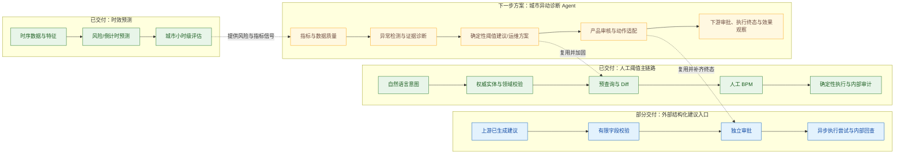

# 滴滴三个项目总览

更新日期：2026-09-04

## 1. 一条业务主线

三个项目不应被讲成彼此无关的技术清单。它们共同围绕同一个业务闭环：

> 用时效模型识别车辆风险和运维优先级，用城市诊断解释指标异动并形成调整建议，再通过阈值平台完成预览、审批、执行和审计。

其中“预测”和“执行”已有较强事实证据；“自主城市诊断”目前应按方案设计讲述，除非后续补到上线材料。

图中刻意拆开三条事实边界：人工阈值链路的能力不能整体外推到外部结构化入口；外部入口当前也不能证明完整预查询、Diff、实体校验和可供上游查询的执行终态。城市诊断的发现、取证、推荐与效果闭环均属于下一步方案。

## 2. 三项目对照

| 项目 | 解决的问题 | 主要产物 | 最强证据 | 当前可讲状态 |
|---|---|---|---|---|
| 全国换电工单时效预测 | 有限换电人力下，哪些车更可能尽快发生关键用户事件 | 87 维 XGBoost、时序特征链路、Java 接入契约、线上评估 | 181 日 782.98 万行；31.85 万同工单；MAE -2.30%；196/228 城改善 | 已交付模型与接入/评估材料；正式目标未全面达成 |
| 车辆阈值智能调整系统 | 把运营自然语言安全转换成复杂车辆阈值配置 | 实体知识 + LLM 解析、Java 校验、三层配置、预查询、BPM、回调、审计 | 42 条金标、239 次调用；Java 校验后 41/42；43 条回放延迟 -79.2% | 已实现核心执行主链路；生产业务量、幂等与最终状态闭环待补 |
| 城市异动诊断 Agent | 从“知道要改什么”前移到“发现异常、解释原因、提出方案” | 受控数据工具/API/MCP、状态化 Workflow、证据评分、推荐护栏、效果回看方案 | 现有阈值执行底座；完整架构、状态、工具和验收设计 | 方案设计；当前材料不能证明多步诊断已上线 |

## 3. 三个项目各自体现什么

### 3.1 时效预测：算法与数据可信度

这个项目最能证明：

- 能定义混合事件 Label 和业务验收口径；
- 能在时序数据上避免穿越并做大规模审计；
- 能用 OOT、同工单和分布标准化识别伪提升；
- 能在旧版 Java/XGBoost 约束下完成模型交付；
- 能诚实披露分桶退化和未达目标。

它适合回答“最复杂的模型项目”“怎样保证线上线下一致”“怎样处理错误实验结论”。

### 3.2 阈值平台：AI 应用的安全落地

这个项目最能证明：

- 能把自然语言变成受控领域命令，而非让 LLM 直写 SQL；
- 能划分 LLM、权威知识、数据库、规则和 BPM 的职责；
- 能处理多维配置、相对更新、日期特例、复制和固定阈值；
- 能设计人审、异步回调、审计和 Agent 专用入口；
- 能以真实日志和金标做模型选型。

它适合回答“做过什么 Agent”“怎样防幻觉”“AI 应用如何进入高风险业务”。

### 3.3 城市诊断 Agent：系统设计与下一步判断

完整的下一阶段建设方案见 [城市异动诊断 Agent 完整建设蓝图](city-agent/README.md)。其中把现有动作底座、待建设能力、LangGraph 状态机、数据/MCP 工具、微调门槛、评测灰度、SLO 和实施运维分开记录，所有未来数字均标为门槛或目标。

这个方案最能展示的系统设计判断是：

- 能把经营诊断拆成有状态、可终止的工具工作流；
- 理解 MCP、Function Calling、Workflow、规则引擎和人工审批的分工；
- 重视数据质量闸门、证据绑定、置信度、ABSTAIN 和回滚；
- 能复用现有生产能力，而不是重造写库链路。

它适合系统设计面或开放题，但现阶段不要作为“已有线上效果”的主项目。

## 4. 共同方法论

### 4.1 先冻结口径，再优化模型

- 时效：先确定 Label、时间窗口、分桶和同样本集；
- 阈值：先确定长期基础、周期调整和日期特例的覆盖语义及动作互斥；
- 诊断：先确定指标口径、数据新鲜度和证据 Schema。

### 4.2 把 AI 放在擅长的位置

- XGBoost 提供时效和排序信号，不负责决定运营策略；
- LLM 理解指令、组织假设和生成解释，不直接拥有数据库权限；
- 程序负责计算、校验、提交审批、受控写入以及幂等与可靠恢复；人负责高风险动作的最终授权，当前系统在可靠恢复和外部终态回传上仍有待补边界；
- 人在高风险变更上保留最终授权。

### 4.3 每个环节都能单独证明

- 时效：数据、模型、特征向量、Java 输出和线上指标分开验证；
- 阈值：解析、预查询、BPM 发起、审批回调、DB 写入和最终回查分开验证；
- 诊断：工具事实、统计异常、模型假设、推荐规则和执行效果分开验证。

### 4.4 负结果也是交付

- 随机 test 的漂亮结果被日期 OOT 否定；
- Label mix 导致的 MAE 假改善被主动推翻；
- 城市拆模只有 0.1165 分钟收益，因复杂度不采用；
- 城市诊断未上线的部分明确按 roadmap 管理；
- SQL 超长已定位，但不能把未完成的事务/幂等治理说成已解决。

## 5. 面试项目选择建议

| 面试方向 | 第一主项目 | 第二项目 | 备用深挖 |
|---|---|---|---|
| AI 应用 / Agent | 阈值智能调整系统 | 城市诊断 Agent 方案 | 时效线上对账与评估 |
| 业务算法 / ML | 时效预测 | 阈值 LLM 评测 | 城市拆模负结果 |
| Java + AI 后端 | 阈值智能调整系统 | Agent 独立审批边界 | SQL 超长与幂等设计 |
| 数据/策略平台 | 时效评估体系 | 阈值三层配置 | 城市诊断指标工具设计 |
| 技术负责人 / 架构 | 三项目端到端闭环 | 城市诊断 roadmap | 边界、风险与演进计划 |

## 6. 一分钟串讲

> 我在滴滴的工作可以概括为“预测风险、解释问题、受控执行”。时效项目从 782.98 万行时序数据中训练换电倒计时模型，并把 87 维特征接入旧版 Java runtime；阈值项目把运营自然语言转成领域命令，再通过权威实体知识、Java 校验、配置预览和 BPM 审批安全落库；在这个执行底座上，我进一步设计了城市异动诊断 Agent，用受控数据工具、状态化 Workflow 和证据评分，把发现异常到提出阈值建议串起来。三个项目共同体现的是：我既能做模型和数据，也能把不确定的 AI 输出接入有规则、有权限、有审计的生产系统。

## 7. 当前最大的事实冲突

初版 `main.tex` 将城市诊断 Agent 写为“核心功能已正式上线并持续迭代”，而现有复盘材料明确说明受控经营数据工具、城市异动识别、多步 Workflow、证据绑定和效果回看仍待建设。

在获得以下任一证据前，应使用“完成下一阶段架构设计”而不是“正式上线”：

- 实际服务或代码仓路径；
- 已部署版本和时间；
- Agent 可调用工具清单与调用日志；
- 城市/用户覆盖和请求量；
- 离线诊断集或线上效果报告；
- BPM 灰度和执行审计。
