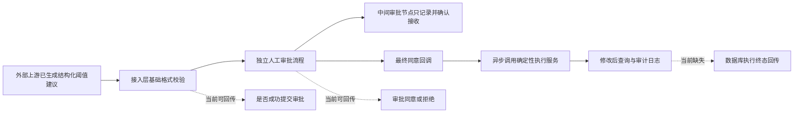

# 城市异动诊断 Agent：现状基线与建设边界

【已证实事实】基线日期：2026-09-04

用途：记录城市异动诊断 Agent 在正式建设前的真实起点，明确哪些能力已经存在、哪些只能复用但尚未接入、哪些完全待建，以及后续从“方案”升级为“成果”所需的证据。

这是一份实施与面试共用的事实边界文档，不是目标架构说明，也不是已经上线的效果报告。详细指标仍以[事实、指标与待补证台账](../evidence/01-事实指标与待补证台账.md)为唯一事实闸门。

## 数字标签约定

本文出现的量化信息必须使用以下标签，避免把目标写成结果：

| 标签 | 含义 |
|---|---|
| 【已证实事实】 | 已有代码、脱敏报告、可复算结果或日志材料支持 |
| 【待测基线】 | 尚未建立统计，需要在开发或试运行前补采 |
| 【规划门槛】 | 设计阶段规定的最低验收条件，不代表已经达到 |
| 【预期目标】 | 基于业务价值提出的改进方向或目标值，不代表承诺或结果 |
| 【实际结果】 | 未来完成实现、部署和评估后回填的真实结果 |

没有证据的数字不得用“约”“预计已经”“通常可以”等表达绕过标签。

## 一句话现状

> 【已证实事实】当前真正存在的是“受控阈值动作底座 + 外部系统结构化建议接入与审批适配器”，而不是城市异动诊断 Agent。

现有链路解决的是：上游已经知道要修改什么以后，怎样把结构化建议送入人工审批，并复用确定性服务执行。

它尚未解决：

- 哪个城市、区域、车型或时段发生了异常；
- 异常是数据问题、需求变化、车辆供给、换电能力、天气、活动还是阈值配置导致；
- 当前是否应该修改阈值；
- 建议值怎样从证据和业务约束中计算；
- 调整完成后是否有效，是否应继续观察或提出回滚建议。

## 当前真实链路



这条链路中需要特别区分三个状态：

- “参数校验通过”只代表输入满足当前接入层的有限格式要求；
- “审批通过”只代表人工流程给出同意结论；
- “配置生效”必须由数据库执行结果和最终查询共同证明。

当前外部上游能够收到前两个阶段的信息，但没有完整收到第三个阶段的执行终态。

## 已实现能力

### 结构化建议接入

【已证实事实】当前存在一条面向外部系统的结构化阈值建议接入链路。上游直接传入已经生成的修改对象，接入层不会再次调用 LLM 生成 JSON。

当前接入层能够完成：

- 校验请求和结构化修改对象是否存在；
- 只接受更新动作；
- 校验城市和区域标识为合法正数形式；
- 校验车型列表非空；
- 校验普通阈值调整值为整数形式；
- 校验星期和整点时间范围；
- 拒绝固定阈值、复制配置、比例参数等复杂修改混入该入口；
- 将校验通过的结构化对象转换为审批请求；
- 记录请求关联信息、校验结果和审批提交结果。

必须明确：自然语言指令在这条链路中主要承担展示和审计作用，真正决定执行范围的是上游已经构造好的结构化对象。因此，不能把该入口描述为“自主理解城市异动并生成调整策略”。

### 独立审批入口与人审边界

【已证实事实】外部系统建议与人工页面申请使用可区分的审批入口，能够为 Agent 建议保留独立的人审边界。

当前审批链路能够：

- 保存完整可执行载荷供审批回调使用；
- 展示城市、区域、车型、时间和修改动作摘要；
- 在中间审批节点只记录结果并返回确认，不执行阈值修改；
- 在最终同意回调后异步触发确定性执行；
- 对拒绝、结束或撤回结果进行记录和通知。

这证明“Agent 建议不能绕过人工授权”的基本方向已经存在，但终态识别、持久化幂等和执行结果回传仍需加固。

### 确定性阈值执行

【已证实事实】既有执行服务支持查询和修改两类动作，修改时读取当前配置、应用明确的业务更新逻辑，执行后再查询结果。

可复用的工程能力包括：

- 按城市、区域、时段、星期和车型查询当前配置；
- 对普通阈值做相对或绝对修改；
- 以当前真实配置作为读改写基础；
- 修改完成后返回最终查询结果；
- 记录每个条件的开始、结束、影响行数、异常和最终结果；
- 保留人工审批和执行链路的审计信息。

这里的“执行后查询”目前主要进入内部返回和审计，尚未形成外部 Agent 可查询的持久化执行状态。

### 人工链路中的解析和实体校验

【已证实事实】更完整的自然语言解析、城市与区域实体知识、城市—区域—车型归属校验、多指令完整性检查，已经存在于人工阈值操作链路。

这些能力证明团队已有处理以下问题的经验：

- 模型输出格式正确但业务范围错误；
- 区域不属于目标城市；
- 车型不属于目标区域；
- 多条输入被模型静默漏掉；
- 查询动作误带更新字段；
- 一条修改中混入互斥操作。

但这些校验当前嵌在人工解析服务内部，没有被外部结构化建议入口完整复用，因此只能列为“已有可复用资产”，不能写成“Agent 直传链路已完成同等强度校验”。

### 审计与可观测基础

【已证实事实】现有系统已经按解析、审批提交、审批回调、条件执行、数据库写入和结果查询等阶段记录日志，并具备请求关联字段。

这为未来建设统一 Trace 提供了基础，但日志不是 Workflow 状态库。当前日志不能替代：

- 可恢复的任务状态；
- 唯一建议版本；
- 审批与执行的持久化映射；
- 节点重试记录；
- 失败后的恢复位置；
- 调整后的观察任务状态。

## 已有量化证据与适用边界

以下数字属于“阈值自然语言解析与模型回放”，不属于城市诊断 Agent：

| 指标 | 现有证据 | 使用限制 |
|---|---:|---|
| 领域金标规模 | 【已证实事实】42 条 | 评估阈值命令解析，不评估城市异常诊断 |
| 累计模型调用 | 【已证实事实】239 次 | 包含选型、参数试验和复测 |
| 候选模型裸通过 | 【已证实事实】40/42 | 离线候选配置，不是生产长期准确率 |
| 程序后置校验后通过 | 【已证实事实】41/42 | 证明结构化解析治理价值，不证明诊断正确率 |
| 最终候选平均延迟 | 【已证实事实】11.61 秒 | 离线解析环境，不是完整 Agent 延迟 |
| 最终候选延迟 P95 | 【已证实事实】20.21 秒 | 不包含数据查询、Workflow、审批和执行 |
| 真实请求回放规模 | 【已证实事实】43 条 | 是阈值解析日志回放，不是城市诊断案例 |
| 回放平均延迟变化 | 【已证实事实】34.43 秒降至 7.17 秒，下降 79.2% | 不是同时在线 A/B，也不能外推为城市诊断提速 |

详细口径见[阈值系统 LLM 评测卡](../evidence/03-阈值系统LLM评测卡.md)。

城市诊断目前的量化状态是：

| 城市诊断指标 | 当前状态 |
|---|---|
| 历史诊断金标数量 | 【待测基线】暂无 |
| 已接入只读诊断工具数量 | 【待测基线】审计范围内暂无正式实现 |
| 已覆盖异常类型数量 | 【待测基线】暂无 |
| 根因 Top-K 命中率 | 【待测基线】暂无 |
| 关键证据引用覆盖率 | 【待测基线】暂无 |
| 正确拒答率 | 【待测基线】暂无 |
| 只读诊断 QPS | 【待测基线】暂无 |
| 端到端诊断延迟 | 【待测基线】暂无 |
| 建议采纳率 | 【待测基线】暂无 |
| 审批后执行成功率 | 【待测基线】暂无专项统计 |
| 人工排查耗时 | 【待测基线】暂无 |
| 调整后业务效果 | 【待测基线】暂无可归因结果 |

## 可复用但尚未接入的能力

| 可复用资产 | 当前所在链路 | 接入城市诊断 Agent 前要做什么 |
|---|---|---|
| 城市、区域和车型知识 | 人工自然语言解析 | 改造成模型与程序共用的权威 Scope 服务，并补版本和更新时间 |
| 城市—区域—车型归属校验 | 人工解析后置校验 | 抽成公共领域校验服务，禁止 Agent 入口维护弱化副本 |
| 多指令完整性校验 | 人工解析后置校验 | 扩展为“输入目标—推荐目标—执行目标”全链路覆盖检查 |
| 当前配置查询 | 人工预查询和执行服务 | 包装成只读、可审计、带配置版本的工具 |
| 配置合并与读改写 | 确定性执行服务 | 增加版本比较、并发冲突和建议过期处理 |
| 修改后查询 | 执行服务 | 持久化为执行终态，并提供上游查询和回调 |
| 人工审批 | 现有申请流程 | 建立任务、建议版本、审批实例和执行尝试的持久化关系 |
| 阶段化审计日志 | 解析、审批和执行 | 升级为 Trace、状态事件与可回放数据，不只依赖文本日志 |
| 结构化解析评测方法 | 阈值 LLM 评测 | 迁移评测思路，重新建立城市诊断专属数据集和指标 |

这些资产可以缩短建设路径，但“能复用”不等于“已经接入”。每项能力升级状态前，都必须补代码、测试、调用轨迹或效果报告。

## 完全待建能力

### 观察与触发

- 经营指标语义层和统一口径；
- 数据水位、完整性、重复和异常值检查；
- 定时巡检、指标告警和人工提问触发；
- 告警去重、聚合、抑制、静默期和升级策略；
- 城市、区域、车型和时段的动态范围发现；
- 告警与既有变更、故障、活动的关联。

### 只读数据工具层

- 受控指标快照工具；
- 同比、环比、滚动和同群基线工具；
- 城市、区域、车型和小时趋势下钻工具；
- 车辆供给、低电积压和换电能力工具；
- 天气、节假日、活动和运维事件工具；
- 当前阈值和历史变更工具；
- 指标口径解释工具；
- 工具权限、超时、限流、缓存和审计；
- MCP Server 或同等强约束工具协议。

### 确定性异常检测

- 最小样本门槛；
- 季节性和节假日基线；
- 稳健异常分数；
- 多指标一致性判断；
- 数据异常和业务异常分离；
- 城市规模、车型结构和运营模式分群；
- 异常严重度、持续性和影响范围计算；
- 告警阈值的离线回放和误报评估。

### 原因诊断

- 可维护的异常原因分类体系；
- 候选原因生成与反驳条件；
- 有预算的工具选择和定向下钻；
- 证据、反证和未知项的结构化表达；
- 假设冲突处理和主动拒答；
- 结论到证据的完整引用校验；
- 面向运营人员和研发人员的不同解释视图。

### 状态化 Workflow

- 显式且可序列化的任务状态；
- 节点级输入、输出和版本；
- 持久化 Checkpoint；
- 超时、重试、降级和人工接管；
- 有界工具循环和终止条件；
- 审批处暂停并在回调后准确恢复；
- 多实例任务抢占和并发控制；
- 失败重放与确定性重放约束；
- Prompt、模型、工具和数据版本共同追踪。

### 阈值推荐与安全护栏

- 判断异常是否真的适合用阈值解决；
- 基于规则或优化器计算允许候选范围；
- 核心指标和风险指标的联合约束；
- 调整幅度、绝对上下限和影响范围校验；
- 在途审批、冷却期和频繁反向调整检查；
- 当前配置版本和建议过期检查；
- 修改前后 Diff 与影响预估；
- 低置信度或证据冲突时强制不建议修改。

### 执行可靠性

- 持久化任务主键和建议版本；
- 审批提交幂等；
- 审批回调去重；
- 最终审批节点的程序化校验；
- 执行幂等和数据库版本比较；
- 批量修改的事务、拆批、补偿和部分成功语义；
- 可靠任务队列或事务化 Outbox；
- 进程重启后的任务恢复；
- 数据库最终状态查询接口；
- 执行终态通知外部 Workflow。

### 效果评估与学习闭环

- 调整前观察窗口；
- 调整后短期和长期观察任务；
- 相似未调整区域或其他合理对照；
- 天气、活动、供给变化等混杂因素记录；
- 核心指标、风险指标和回滚条件；
- 专家采纳、修改和驳回原因回流；
- 失败案例、误报、漏报和无效建议数据集；
- 规则、工具描述、Prompt 和模型版本回归评测；
- 回滚建议生成，但不让模型自动执行高风险回滚。

### 运维与治理

- 调用方身份、权限、签名和来源校验；
- 城市和数据范围授权；
- 单任务预算、并发、限流和熔断；
- 模型、数据工具、审批和执行服务分层降级；
- 延迟、错误、成本、循环次数和拒答监控；
- 异常任务排查页面；
- 人工接管、重跑、取消和审计导出；
- Prompt Injection、工具参数污染和越权测试；
- 敏感数据最小化与日志脱敏。

## 已知风险

### 审批状态与执行状态混淆

审批结果通知独立于数据库异步执行。审批同意后，执行仍可能因为载荷缺失、当前配置变化、数据库异常或批量写入失败而失败。

改进要求：将 `APPROVED`、`EXECUTING`、`EXECUTED`、`EXECUTION_FAILED`、`VERIFIED` 建模为不同状态，对外只在最终查询完成后报告配置终态。

### 缺少持久化幂等

当前请求关联字段没有形成可证明的唯一约束和持久化状态机。审批提交重试、回调重复和服务重启都可能使状态难以判断。

改进要求：采用任务标识、建议版本和流程阶段组合的幂等键，并持久化每次状态转移和外部副作用。

### 回调终态依赖流程配置

中间节点已经有“只记录不执行”的独立处理，但最终执行处理本身没有额外证明流程已经终结，也没有持久化执行去重。

改进要求：同时校验流程终态、审批阶段、任务来源、建议版本和是否已执行；未知状态只确认接收，不触发写入。

### Agent 直传路径校验不足

当前直传路径以字段格式校验为主，没有完整复用人工链路中的城市—区域—车型权威归属校验，也没有证明调整后的值经过完整业务上下限验证。

改进要求：人工与 Agent 必须共用同一个领域校验服务；模型或上游系统不能通过选择不同入口降低校验强度。

### 缺少配置版本保护

建议产生、人工查看和最终审批之间可能跨越较长时间。期间配置可能已被其他申请修改。

改进要求：建议生成时记录配置版本或稳定指纹，执行前比较；发生变化时将建议标为过期并重新 Dry Run。

### 异步任务不耐进程故障

当前部分通知和执行依赖进程内异步线程，缺少可证明的持久化队列、Outbox 和恢复机制。

改进要求：外部副作用使用可靠任务记录驱动；重试前先查询现状，不能盲目重复提交或重复写入。

### 批量操作的原子性不清晰

多个修改条件按顺序执行，已有材料还显示大批量写入可能触发长度限制。当前没有证据证明整次申请具有全局事务或可靠补偿。

改进要求：先定义全成全败、按条件独立还是允许部分成功，再设计拆批、事务、状态记录、补偿和重试。

### 调用方安全边界待补证

审计范围内没有发现足以证明外部 Agent 调用方身份校验、请求签名和城市级授权的完整材料；它们可能由外部网关承担，但当前不能据此声称已完成。

改进要求：补充经过脱敏的鉴权架构、权限矩阵、重放保护和安全测试证据。

### 日志不等于状态存储

日志能够帮助排障，但不能可靠回答某个任务当前卡在哪一步、能否重试、是否已经造成外部副作用。

改进要求：将任务状态作为业务数据持久化，日志和 Trace 作为旁路观测手段。

### 图编排依赖不等于 Workflow 已落地

【已证实事实】当前工程存在图编排库依赖和早期脚手架，但实际业务节点、边和注册未形成可运行的城市诊断图，也没有 Checkpoint 与人工暂停恢复证据。

因此只能说“做过早期技术探索”，不能说“已经使用 LangGraph 或其他图框架实现城市诊断 Workflow”。

## 从现状到目标的 Gap

| 目标能力 | 当前起点 | 核心 Gap | 升级为已实现所需证据 |
|---|---|---|---|
| 自动发现异常 | 只有外部上游主动给出建议 | 缺指标、基线、告警和异常检测 | 脱敏数据契约、检测代码、历史回放、误报漏报报告 |
| 解释异常原因 | 没有诊断工具循环 | 缺原因分类、工具、证据和终止策略 | Workflow 代码、工具轨迹、专家标注和 Badcase |
| 生成可信建议 | 上游直接提供阈值对象 | 缺推荐器、候选范围和反例检查 | 推荐规则、离线一致率、越界阻断测试 |
| 安全 Dry Run | 人工链路可先查询，Agent 未自动串联 | 缺版本化查询、Diff 和影响预估 | Dry Run 返回样例、集成测试、配置版本冲突测试 |
| 可暂停可恢复 | 审批与执行是异步回调 | 缺持久化状态、Checkpoint 和恢复语义 | 状态表、恢复测试、重复回调与重启测试 |
| 可靠执行终态 | 执行后内部回查 | 缺对外终态、幂等、Outbox 和补偿 | 状态查询、最终回调、故障注入和一致性报告 |
| 效果闭环 | 没有观察任务 | 缺前后窗口、对照和混杂因素治理 | 观察任务记录、评估报告和回滚建议记录 |
| 可持续评测 | 只有阈值解析评测 | 缺诊断专属金标和分层指标 | 数据集版本、评测代码、基线报告和回归报告 |
| 生产运维 | 有阶段日志 | 缺统一 Trace、SLO、告警和人工控制台 | 仪表盘、告警规则、演练记录和处置手册 |

### 建设顺序上的关键判断

建设顺序分成“最小安全契约”和“完整动作闭环”两层。只读诊断开发前，先定义可被 Python Workflow 与 Java 服务共同执行的领域校验、配置版本和幂等状态契约；完整 Action Adapter 可以与只读诊断并行演进，但必须在 Canary 前完成并通过故障注入。原因是：即使首版不写生产，建议一旦接入审批，就会放大幂等、版本和执行终态缺口。

推荐顺序：

```text
最小共享领域校验、配置版本与幂等状态契约
→ 只读指标工具和数据质量闸门
→ 确定性异常检测
→ 有界诊断 Workflow 与证据约束
→ 建议生成但只供人工查看
→ 完整 Action Adapter：持久化幂等、Diff/Dry Run、Outbox、终态与回滚
→ 小范围人工确认后提交审批
→ 执行效果观察和评测回流
```

在只读诊断阶段，不应为了“看起来更像 Agent”而提前开放生产动作工具。完整 Action Adapter 未达到[评测文档](04-评测灰度SLO与量化目标.md)的安全门槛时，不得进入 Canary。

## 建设前必须补采的 Baseline

Baseline 必须同时满足[评测文档](04-评测灰度SLO与量化目标.md)规定的采集周期和样本门槛；时间到了但严重异常或关键切片不足时继续采集。统一事件点为 `T_detectable/T_alert/T_ack/T_evidence_ready/T_recommendation/T_product_review/T_downstream_approval/T_execution_final/T_recovery`，其中 `MTTD = T_alert - T_detectable`，`MTTA = T_ack - T_alert`。

### 业务痛点基线

| 问题 | 需要采集的定义 | 当前状态 |
|---|---|---|
| 从异常可检测到系统告警的耗时 | `T_alert - T_detectable`（MTTD） | 【待测基线】暂无 |
| 从系统告警到人工接手的耗时 | `T_ack - T_alert`（MTTA） | 【待测基线】暂无 |
| 单次人工诊断耗时 | 首次打开问题到形成可执行结论的人工时间 | 【待测基线】暂无 |
| 单次诊断数据操作量 | 查询次数、报表数量、手工 SQL 次数 | 【待测基线】暂无 |
| 重复告警负担 | 同一根因产生的重复告警数量及人工处理次数 | 【待测基线】暂无 |
| 建议到审批提交耗时 | 形成结论到审批成功创建的时间 | 【待测基线】暂无 |
| 审批到实际生效耗时 | 审批同意到最终配置回查成功的时间 | 【待测基线】暂无 |
| 误调和回滚情况 | 无效调整、反向调整、紧急撤回及原因 | 【待测基线】暂无 |
| 效果回收覆盖率 | 有正式调整后分析的修改占比 | 【待测基线】暂无 |

### 技术基线

| 能力 | 需要建立的 Baseline | 当前状态 |
|---|---|---|
| 数据工具 | 成功率、延迟、数据水位、返回规模、缓存命中 | 【待测基线】暂无 |
| 异常检测 | Precision、Recall、告警量、持续性和分层表现 | 【待测基线】暂无 |
| 诊断 | Top-K、证据覆盖、反证检查和拒答正确率 | 【待测基线】暂无 |
| Workflow | 节点数、工具调用数、循环次数、恢复成功率 | 【待测基线】暂无 |
| 模型 | Token、延迟、成本、结构化输出和工具参数正确率 | 【待测基线】暂无 |
| 执行 | 审批成功率、执行成功率、重复执行、最终一致性 | 【待测基线】暂无专项统计 |
| 效果 | 核心指标、风险指标、对照差异和回滚触发 | 【待测基线】暂无 |

### 当前可先确定的安全不变量

- 未经产品审核与下游 BPM 授权不得进入生产写入；
- 同一建议不能因重试重复提交审批或重复执行；
- 最终结论必须引用可校验的证据，证据不足时只能保留为假设或 ABSTAIN；
- 阈值建议必须通过 Schema、领域、权限、配置版本和在途状态校验；
- 数据质量不通过时不得生成生产建议；
- 执行必须能查询确定终态，并具备审计和回滚路径。

所有具体样本量、比例、延迟、QPS、SLO 和业务改善目标只在[评测、灰度、SLO 与量化目标](04-评测灰度SLO与量化目标.md)维护。本文只固定事实边界和不变量，不另建一套数字。

## 模型和数据的当前边界

### 当前没有城市诊断微调模型

【已证实事实】审计材料中没有发现城市异常诊断 SFT、偏好优化、奖励模型或专项微调的实现与实验报告。

因此不能声称“通过微调提升城市诊断准确率”。下一阶段应先用强约束 Workflow、受控工具、结构化输出和评测集建立可测基线，再根据错误分布判断是否需要微调。

只有满足以下条件时才值得进入微调评估：

- 已积累足够且质量稳定的专家诊断轨迹；
- Prompt、工具描述和确定性规则无法经济地修复主要错误；
- 错误具有稳定重复模式，而不是数据缺失或工具失败；
- 训练、验证和时间外测试可以严格隔离；
- 微调收益能够超过模型升级、缓存或规则优化带来的收益；
- 线上仍保留证据校验、权限和执行护栏。

### 当前没有城市诊断专属数据集

【待测基线】目前暂无经过确认的城市异常案例数、异常类型分布、专家根因标签和阈值建议金标。

未来每条案例至少要保存：

- 告警时刻能够看到的数据快照，避免未来信息泄漏；
- 城市、区域、车型、时段和指标口径版本；
- 数据质量状态；
- 专家确认的异常类型和关键证据；
- 被排除的替代原因；
- 是否适合通过阈值处理；
- 允许的建议范围和禁止条件；
- 人工采纳、修改或驳回原因；
- 实际执行终态；
- 调整后观察结果和混杂因素。

## 面试表达边界

### 当前安全表述

> 我已经完成阈值智能调整系统中的结构化解析、领域校验、配置查询、人工审批、确定性执行和审计等核心底座，并建设了一个接收外部结构化阈值建议的独立审批入口。在此基础上，我进一步设计城市异动诊断 Agent，计划补齐只读数据工具、异常检测、证据驱动诊断、状态化 Workflow、受约束建议和效果回看。当前城市诊断部分仍是下一阶段建设方案，不把规划说成上线结果。

如果面试官追问“现在 Agent 到底做到了哪一步”，应直接回答：

> 当前做到的是建议接入到审批和异步执行尝试的动作底座；异常发现、原因诊断和效果学习还没有正式落地。现有接口要求上游先给出结构化调整对象，本系统负责有限校验并提交人工审批，审批同意后异步尝试执行；当前外部链路尚不能证明最终落库终态。下一步先冻结共享校验、配置版本和幂等状态的最小契约，再启动只读诊断 Workflow；完整执行终态、Outbox 与补偿可并行建设，但未通过故障测试前不能进入 Canary。

### 当前不可声称

- 城市异动诊断 Agent 已经全量上线；
- 已自动发现异常并自主生成阈值调整建议；
- 已接入 Hive MCP、天气、活动、运维告警或其他经营数据工具；
- 已落地 LangGraph、持久化 Checkpoint 或完整 Human-in-the-loop Workflow；
- 已具备多 Agent 协作；
- 已训练或微调城市诊断模型；
- 已有城市诊断准确率、Top-K、QPS、P95 或单次成本；
- 已显著降低运营排查耗时；
- 已提升订单、履约、换电效率或其他业务指标；
- 已具备长期线上建议采纳率；
- 审批通过就等于数据库修改成功；
- 已完成持久化幂等、自动回滚和执行终态回传；
- 阈值解析的离线金标结果就是城市诊断 Agent 的效果。

### 从设计升级为成果的证据要求

| 可升级表述 | 最少需要的证据 |
|---|---|
| “实现只读诊断 Agent” | 可运行 Workflow、持久化状态、工具调用轨迹、脱敏案例和离线评测 |
| “接入 MCP 数据工具” | Server 与 Client 代码、工具 Schema、权限方案、调用日志和故障测试 |
| “能够识别城市异常” | 时间切分数据集、异常定义、基线、Precision/Recall 和分层 Badcase |
| “能够诊断根因” | 专家标签、Top-K 指标、关键证据覆盖、反证检查和拒答评测 |
| “能够生成阈值建议” | 推荐规则、合法率、专家一致率、越界阻断和 Dry Run 记录 |
| “接入审批执行闭环” | 任务与审批映射、幂等测试、执行终态、最终回查和失败恢复 |
| “产生业务效果” | 明确观察窗口、合理对照、混杂因素、核心与护栏指标及正式报告 |

## 维护检查清单

每次更新城市诊断 Agent 材料时检查：

- [ ] 是否先区分“现有代码”“可复用资产”“规划设计”和“实际结果”？
- [ ] 新增数字是否使用了【已证实事实】【待测基线】【规划门槛】【预期目标】【实际结果】之一？
- [ ] 【实际结果】是否有部署版本、样本、时间窗口、对照和计算口径？
- [ ] 是否把阈值解析评测误写成城市诊断评测？
- [ ] 是否把审批同意误写成配置生效？
- [ ] 是否把日志能力误写成持久化 Workflow 状态？
- [ ] 是否把图框架依赖或示例代码误写成已落地 Workflow？
- [ ] 是否把可以复用的人工链路能力误写成 Agent 已经接入？
- [ ] 是否明确记录数据时间、水位、口径和证据来源？
- [ ] 是否保留 ABSTAIN、人工接管、权限、幂等和降级边界？
- [ ] 是否有代码、测试、调用轨迹和效果报告支撑状态升级？
- [ ] 是否同步更新[事实、指标与待补证台账](../evidence/01-事实指标与待补证台账.md)？
- [ ] 是否避免写入内部接口路径、类名、流程标识、真实业务 ID、公司表名、原始 SQL 和未脱敏日志？
- [ ] 是否确认规划门槛没有被简历或面试材料改写成实际成果？
- [ ] 是否保持 `main.tex` 不变，直到本人明确确认开始修改简历？
- [ ] 是否在提交或推送前得到本人明确授权？
