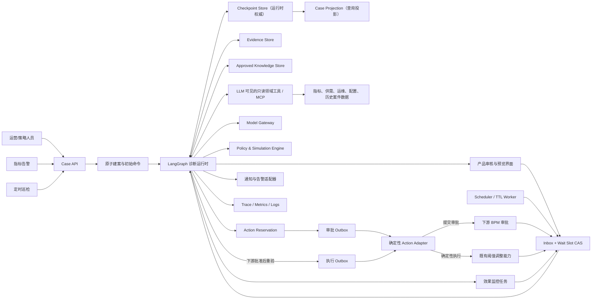

# 城市异动诊断 Agent：LangGraph 架构与状态机设计

> 状态：未来方案，当前未实现。
>
> 当前能够确认的基础只有“已有受控的阈值调整能力，可作为未来执行端”。本文中的 LangGraph 工作流、诊断工具、MCP、持久化、人工审批、告警、效果监控、多 Agent 和各项 SLO 均是下一阶段设计，不代表已经开发、部署或产生业务收益。

## 1. 设计目标

系统面向城市运营人员、策略人员和一线运维人员，将“发现指标异动—收集证据—判断原因—给出动作建议—受控执行—观察效果”组织为一个可恢复、可审计、可评测的闭环。

最终输出不应只有一段自然语言，而应包含：

- 异动是否真实、严重程度和影响范围；
- 已验证的主要原因、备选原因和反证；
- 每项结论所绑定的证据、数据时间和质量状态；
- 阈值调整建议，以及不调整阈值时的运维、告警或继续观察建议；
- 调整前后差异、保护边界、预期影响、观察窗口和回滚条件；
- 信息不足时明确停止，并说明缺少什么，而不是强行给出结论。

### 1.1 核心工程目标

1. **可控**：流程和副作用由代码控制，模型不能绕过权限、校验和审批。
2. **可恢复**：查询超时、进程重启或等待审批后，可以从最近的可靠状态继续。
3. **可解释**：任何诊断和建议都能回溯到证据，而不是只保留最终回答。
4. **可评测**：能够分别评测工具选择、参数、证据、轨迹、诊断、建议和业务效果。
5. **可演进**：先做单协调器和固定图；只有评测证明需要时，再增加多 Agent。
6. **可审计**：记录模型、Prompt、工具、策略和建议版本，以及审批和执行结果。

### 1.2 非目标

- 不让模型直接生成并执行任意 SQL。
- 不把聊天历史当作业务事实库。
- 不追求首版全自动修改业务配置。
- 不用“用了多 Agent”或“做了微调”作为项目目标。
- 不把离线回放、Shadow 运行或建议被生成写成生产收益。

## 2. 为什么选择 LangGraph

### 2.1 选择理由

本场景有长流程、并行查询、条件分支、人工审批、失败恢复和有副作用的最终动作，比自由循环式 Agent 更接近一台持久化状态机。LangGraph 的定位正是长时间、带状态的 Agent 编排运行时，核心能力包括 durable execution、persistence、streaming 和 human-in-the-loop。[LangGraph 官方概览](https://docs.langchain.com/oss/python/langgraph/overview)

具体对应关系如下：

| 城市诊断需求 | LangGraph 能力 | 设计用法 |
|---|---|---|
| 一个案件可能跨分钟、小时甚至审批日 | Checkpointer | 每个案件使用稳定的 `thread_id` 保存状态 |
| 查询或模型节点失败后继续 | Durable execution | 从 checkpoint 重放，而不是整条链重跑 |
| 多类证据可同时获取 | Fan-out / fan-in | 并行只读节点，统一进入证据校验节点 |
| 写阈值前等待人工 | `interrupt()` / `Command(resume=...)` | 保存状态，审批后恢复同一案件 |
| 调试错误路径 | State history / replay | 从历史 checkpoint 复现或派生测试分支 |
| 当前案件与跨案件经验不同 | Checkpointer + Store | State 保存当前案件；Store 保存长期、经审核知识 |

[LangGraph Persistence](https://docs.langchain.com/oss/python/langgraph/persistence)明确区分：Checkpointer 保存单个 thread 的图状态，Store 保存跨 thread 的长期信息。这一边界应直接映射到“当前诊断案件”和“历史经验库”。

### 2.2 为什么不是完全自主 Agent

Anthropic 将 Workflow 定义为由代码预先编排的路径，将 Agent 定义为由模型动态决定过程和工具使用的系统；其生产建议是从简单、可组合的模式开始，只有在灵活性确有价值时增加自治程度。[Anthropic：Building effective agents](https://www.anthropic.com/engineering/building-effective-agents)

因此本项目采用“确定性外壳 + 有限 Agent 节点”模式：

- 代码决定权限、数据质量、并行分支、审批、写入、监控和回滚；
- 模型只负责问题拆解、有限假设生成、证据综合、解释和建议草拟；
- 模型输出必须进入结构化 Schema 和确定性校验；
- 任何有业务副作用的行为都不能由模型的一句话直接触发。

### 2.3 替代方案

| 方案 | 适用情况 | 本项目结论 |
|---|---|---|
| OpenAI Agents SDK | 主要使用 OpenAI 模型，希望直接使用 Sessions、Tracing、Guardrails、Handoffs 和审批 | 是可行替代；首版不要与 LangGraph 同时承担主编排 |
| Temporal、Dapr、Restate | 公司已有工作流基础设施，需要跨服务、跨天、强 SLA 的 durable workflow | 后期可以让其承载外层业务工作流；LLM 子图仍可由 LangGraph 管理 |
| 普通任务队列 + 数据库状态机 | 流程较简单，团队不愿引入 Agent 框架 | 可行，但 checkpoint、interrupt、replay、图可视化和评测需自行建设 |
| 单次 Prompt / ReAct 循环 | 演示或低风险问答 | 不适合受控配置写入和生产诊断闭环 |

OpenAI Agents SDK 也支持审批中断和序列化 `RunState`，并给出了 Dapr、Temporal、Restate 的 durable execution 集成；如果未来技术栈改变，可以整体替换运行时，而不应在同一首版中嵌套两套控制循环。[OpenAI Agents SDK：Running agents](https://openai.github.io/openai-agents-python/running_agents/)、[Human-in-the-loop](https://openai.github.io/openai-agents-python/human_in_the_loop/)

## 3. 总体架构



### 3.1 服务边界

- **Case API**：认证后在图外原子创建案件和初始命令，再启动 Graph；查询读取投影，必要时回源 Checkpoint；不包含模型逻辑，也不允许客户端填写内部状态。
- **LangGraph Runtime**：流程状态机、节点调度、条件边、中断和恢复。
- **Model Gateway**：统一模型调用、超时、重试、限流、模型版本和用量记录。
- **Read Tool Layer**：向模型暴露固定白名单的高层只读工具，隐藏底层表和内部接口；模型永远拿不到写工具。
- **Evidence Store**：保存不可变的查询结果、快照、来源、时间和校验信息。
- **Policy Engine**：用确定性规则检查建议的范围、幅度、冲突和风险。
- **Simulation Engine**：对候选建议做回放或规则模拟，不产生真实写入。
- **Product Review Service**：展示结构化预览，接收产品侧批准、编辑、拒绝或补证请求；它与下游 BPM 审批不是同一状态。
- **Inbox / Scheduler**：把人工决定、审批回调、执行回执和观察到期统一变成有唯一键的恢复事件；用 Wait Slot 的 compare-and-set 解决人工提交与 TTL 过期竞争。
- **Action Reservation / Outbox**：以不可变候选和 `payload_hash` 原子预占动作；审批提交与获批后的执行分别通过可靠 Outbox 投递，避免“先查后写”竞态，也避免下游未批准就产生执行命令。
- **Action Adapter**：普通确定性应用代码，对接下游 BPM 和既有阈值能力，负责提交、查询、回执归一化与审计；不是 LLM/MCP 工具。
- **Monitoring Worker**：在执行后按观察窗口计算效果和护栏指标。
- **Checkpoint 与 Case Projection**：Checkpoint 是工作流状态的权威来源；Case 表只作面向查询的派生投影，可由 checkpoint/事件重建，不能与 Graph State 双主写。

### 3.2 部署建议

- Python 3.12、FastAPI、LangGraph、Pydantic；
- PostgreSQL 承担 Case 投影、Checkpoint、Wait Slot、Inbox、Outbox、审批、动作预占和元数据持久化；关键唯一约束和 CAS 必须落数据库；
- 对象存储或低成本数据库保存较大证据正文；
- Redis 只用于缓存、限流、短期锁和任务去重，不作为唯一事实存储；
- Java 现有执行系统在抽取共享领域校验、补齐版本与幂等后，继续承担最终业务合法性检查和真实写入；
- OpenTelemetry 接入统一可观测平台；开发期可以使用 LangSmith 做轨迹评测。

## 4. State Schema

State 只保存控制流需要的小型、可序列化数据；大查询结果存入 Evidence Store，State 中仅保存引用和摘要。这样可以避免 checkpoint 过大、模型上下文污染和敏感数据扩散。

### 4.1 外部输入、内部 State、公开输出和可信 Context 必须分开

原始 HTTP 请求不能直接反序列化成完整 `DiagnosisState`。否则调用方可能伪造 `allowed_actions`、审批结果、建议版本或执行引用。推荐分四层：

1. `CreateCaseRequest`：外部调用方能提交的业务问题，不含身份、权限或内部状态；
2. `CaseInput`：Case API 完成认证、生成案件 ID 后构造的窄化 Graph 输入；
3. `DiagnosisState`：只在图内流转的完整状态；
4. `PublicCaseOutput`：经过脱敏、字段白名单和再次校验后返回给调用方的结果。

登录主体、授权服务、模型网关、数据库连接和动作适配器通过 `Runtime[TrustedContext]` 注入，不能从用户可写 State 获取。State 中的请求人只是一份审计副本，不是授权凭据。LangGraph 支持独立 input/output schema 和 runtime `context_schema`；需要注意，私有字段在某些流式模式下仍可能出现，因此外部 Stream 也必须限定 `output_keys` 并经过 API 脱敏。[LangGraph Graph API](https://docs.langchain.com/oss/python/langgraph/graph-api)

以下为概念性结构，不代表当前已有代码：

```python
from dataclasses import dataclass
from datetime import datetime
from enum import Enum
from typing import Annotated, Any, Literal, NotRequired, Required, TypedDict

from pydantic import BaseModel, ConfigDict, Field, TypeAdapter


class StrictModel(BaseModel):
    model_config = ConfigDict(extra="forbid")


def merge_unique_strings(left: list[str], right: list[str]) -> list[str]:
    """满足结合律、交换律和幂等性的集合式 Reducer。"""
    return sorted(set(left) | set(right))


def merge_evidence(
    left: list[dict[str, Any]], right: list[dict[str, Any]]
) -> list[dict[str, Any]]:
    """先逐项校验，再按 ID/Hash 确定性去重；同 ID 异内容失败关闭。"""
    validated = [EvidenceRef.model_validate(item) for item in [*left, *right]]
    merged: dict[str, EvidenceRef] = {}
    for item in validated:
        previous = merged.get(item.evidence_id)
        if previous is not None and previous.content_hash != item.content_hash:
            raise ValueError("evidence_id content conflict")
        merged[item.evidence_id] = item
    return [merged[key].model_dump(mode="json") for key in sorted(merged)]


def merge_errors(
    left: list[dict[str, Any]], right: list[dict[str, Any]]
) -> list[dict[str, Any]]:
    """错误也按不可变 ID/Hash 合并，避免重放时重复累计。"""
    validated = [ErrorRecord.model_validate(item) for item in [*left, *right]]
    merged: dict[str, ErrorRecord] = {}
    for item in validated:
        previous = merged.get(item.error_id)
        if previous is not None and previous.record_hash != item.record_hash:
            raise ValueError("error_id content conflict")
        merged[item.error_id] = item
    return [merged[key].model_dump(mode="json") for key in sorted(merged)]


def merge_evidence_relations(
    left: list[dict[str, Any]], right: list[dict[str, Any]]
) -> list[dict[str, Any]]:
    """关系可以新增版本，但已有 relation_id 的内容不能被原地改写。"""
    validated = [
        EvidenceHypothesisRelationRef.model_validate(item) for item in [*left, *right]
    ]
    merged: dict[str, EvidenceHypothesisRelationRef] = {}
    for item in validated:
        previous = merged.get(item.relation_id)
        if previous is not None and previous.content_hash != item.content_hash:
            raise ValueError("relation_id content conflict")
        merged[item.relation_id] = item
    return [merged[key].model_dump(mode="json") for key in sorted(merged)]


class CaseStatus(str, Enum):
    CREATED = "created"
    RUNNING = "running"
    WAITING_FOR_INPUT = "waiting_for_input"
    WAITING_FOR_PRODUCT_REVIEW = "waiting_for_product_review"
    DOWNSTREAM_APPROVAL_PENDING = "downstream_approval_pending"
    READY_TO_APPLY = "ready_to_apply"
    APPLYING = "applying"
    MONITORING = "monitoring"
    COMPLETED = "completed"
    INCONCLUSIVE = "inconclusive"
    REJECTED = "rejected"
    FAILED = "failed"
    CANCELLED = "cancelled"


class AnomalyVerdict(str, Enum):
    CONFIRMED = "confirmed"
    NOT_ANOMALY = "not_anomaly"
    DATA_UNUSABLE = "data_unusable"
    UNKNOWN = "unknown"


class CaseDecision(str, Enum):
    PROCEED = "proceed"
    REQUEST_MORE_EVIDENCE = "request_more_evidence"
    ABSTAIN = "abstain"
    HANDOFF = "handoff"
    CLOSE = "close"


class RecommendationStatus(str, Enum):
    DRAFT = "draft"
    VALIDATED = "validated"
    REVIEW_PENDING = "review_pending"
    REVIEWED = "reviewed"
    REJECTED = "rejected"
    SUPERSEDED = "superseded"


class ProductReviewStatus(str, Enum):
    NOT_REQUIRED = "not_required"
    NOT_STARTED = "not_started"
    PENDING = "pending"
    APPROVED = "approved"
    EDITED = "edited"
    REJECTED = "rejected"
    MORE_EVIDENCE_REQUESTED = "more_evidence_requested"
    EXPIRED = "expired"
    CANCELLED = "cancelled"


class ApprovalStatus(str, Enum):
    NOT_REQUIRED = "not_required"
    NOT_SUBMITTED = "not_submitted"
    SUBMITTED = "submitted"
    PENDING = "pending"
    APPROVED = "approved"
    REJECTED = "rejected"
    EXPIRED = "expired"
    CANCELLED = "cancelled"


class ExecutionStatus(str, Enum):
    NOT_STARTED = "not_started"
    APPLYING = "applying"
    APPLIED = "applied"
    DELIVERED = "delivered"
    FAILED = "failed"
    PARTIAL = "partial"
    UNKNOWN = "unknown"
    ROLLED_BACK = "rolled_back"


class ObservationStatus(str, Enum):
    NOT_SCHEDULED = "not_scheduled"
    SCHEDULED = "scheduled"
    WAITING = "waiting"
    EVALUATING = "evaluating"
    COMPLETED = "completed"
    INCONCLUSIVE = "inconclusive"


class RequestedScope(StrictModel):
    city_refs: list[str] = Field(min_length=1)
    metric_names: list[str] = Field(min_length=1)
    object_refs: list[str] = Field(default_factory=list)


class RequestedTimeWindow(StrictModel):
    start_at: datetime
    end_at: datetime
    timezone: str


class CreateCaseRequest(StrictModel):
    trigger_type: Literal["manual", "alert", "scheduled"]
    requested_scope: RequestedScope
    requested_time_window: RequestedTimeWindow
    user_question: str | None = None
    external_event_ref: str | None = None


class CaseInput(StrictModel):
    """认证后的 Case API 在图外构造；不是 HTTP Body。"""
    case_id: str
    requester_audit_ref: str
    created_at: datetime
    trigger_type: Literal["manual", "alert", "scheduled"]
    requested_scope: RequestedScope
    requested_time_window: RequestedTimeWindow
    user_question: str | None = None
    external_event_ref: str | None = None


class PublicCaseOutput(StrictModel):
    case_id: str
    status: CaseStatus
    diagnosis_summary: dict | None = None
    recommendation_preview: dict | None = None
    product_review_state: ProductReviewStatus = ProductReviewStatus.NOT_STARTED
    downstream_approval_state: ApprovalStatus = ApprovalStatus.NOT_SUBMITTED
    execution_state: ExecutionStatus = ExecutionStatus.NOT_STARTED
    observation_status: ObservationStatus = ObservationStatus.NOT_SCHEDULED
    effect_evaluation: dict | None = None


@dataclass(frozen=True)
class TrustedContext:
    """仅由服务端创建，不持久化到 State，也不进入模型上下文。"""
    principal_ref: str
    authorization_service: Any
    read_tool_registry: Any
    model_gateway: Any
    policy_engine: Any
    constrained_recommender: Any
    action_repository: Any
    action_adapter: Any  # 仅确定性节点可用，绝不转交 Model Gateway。
    control_store: Any
    clock: Any


class EvidenceRef(StrictModel):
    evidence_id: str
    evidence_type: str
    source_type: str
    observed_at: datetime
    window_start: datetime
    window_end: datetime
    decision_cutoff: datetime
    event_time_max: datetime
    available_at_max: datetime | None = None
    ingested_at_max: datetime | None = None
    point_in_time_check: Literal["pass", "fail"]
    freshness_seconds: int
    quality_flags: list[str] = Field(default_factory=list)
    is_truncated: bool = False
    metric_contract_version: str
    query_fingerprint: str
    artifact_ref: str
    summary: str
    content_hash: str


class EvidenceHypothesisRelationRef(StrictModel):
    relation_id: str
    evidence_id: str
    hypothesis_id: str
    stance: Literal["supports", "contradicts", "neutral", "insufficient"]
    verification_status: Literal["deterministic_checked", "expert_verified", "pending"]
    relation_version: int = Field(ge=1)
    content_hash: str


class ErrorRecord(StrictModel):
    error_id: str
    error_type: str
    node: str
    retryable: bool
    record_hash: str


class Hypothesis(StrictModel):
    hypothesis_id: str
    statement: str
    expected_signals: list[str]
    contradicting_signals: list[str]
    relation_ids: list[str] = Field(default_factory=list)
    status: Literal["open", "supported", "weakened", "rejected"] = "open"
    confidence_bucket: Literal["unknown", "low", "medium", "high"] = "unknown"
    calibrated_score: float | None = Field(default=None, ge=0, le=1)


class ConfidenceAssessment(StrictModel):
    """路由只消费校准结果，不消费模型自报置信度。"""
    bucket: Literal["unknown", "low", "medium", "high"]
    calibrated_probability: float | None = Field(default=None, ge=0, le=1)
    calibration_version: str | None = None
    evidence_coverage: float = Field(ge=0, le=1)
    contradiction_count: int = Field(ge=0)
    data_quality_grade: Literal["good", "degraded", "unusable"]
    abstain: bool
    reasons: list[str]


class TargetScope(StrictModel):
    city_refs: list[str] = Field(min_length=1)
    object_type: Literal["city", "zone", "fleet_segment"]
    object_refs: list[str] = Field(default_factory=list)


class ActionIntent(StrictModel):
    """模型只能草拟意图、方向和理由，不能给出可执行数值。"""
    intent_id: str
    action_type: Literal[
        "THRESHOLD_CHANGE", "MONITOR", "OPS_GUIDANCE", "CREATE_TICKET", "ESCALATE"
    ]
    target_scope: TargetScope
    direction: Literal["increase", "decrease", "hold", "not_applicable"]
    objective: str
    rationale: str
    evidence_ids: list[str]


class ThresholdChangeItem(StrictModel):
    parameter_ref: str
    before_value: float
    after_value: float
    unit: str


class BaseActionCandidate(StrictModel):
    action_candidate_id: str
    recommendation_version: int
    parent_candidate_id: str | None = None
    approval_purpose: Literal["proposal", "rollback"]
    target_scope: TargetScope
    evidence_ids: list[str]
    rationale: str
    guardrail_metrics: list[str]
    rollback_conditions: list[dict]
    payload_hash: str
    status: RecommendationStatus = RecommendationStatus.DRAFT


class AdvisoryCandidate(BaseActionCandidate):
    action_type: Literal[
        "MONITOR",
        "OPS_GUIDANCE",
        "CREATE_TICKET",
        "ESCALATE",
    ]
    guidance_text: str


class ThresholdChangeCandidate(BaseActionCandidate):
    action_type: Literal["THRESHOLD_CHANGE"]
    before_snapshot_ref: str
    expected_config_version: str
    change_items: list[ThresholdChangeItem] = Field(min_length=1)
    observation_window_minutes: int = Field(gt=0)


class RollbackCandidate(BaseActionCandidate):
    action_type: Literal["ROLLBACK"]
    rollback_of_execution_ref: str
    restore_snapshot_ref: str
    expected_config_version: str
    change_items: list[ThresholdChangeItem] = Field(min_length=1)
    observation_window_minutes: int = Field(gt=0)


ActionCandidate = Annotated[
    AdvisoryCandidate | ThresholdChangeCandidate | RollbackCandidate,
    Field(discriminator="action_type"),
]
ActionCandidateAdapter = TypeAdapter(ActionCandidate)


class DiagnosisState(TypedDict, total=False):
    """图内状态；与外部请求、可信依赖和公开输出彼此独立。"""
    case_id: Required[str]
    requester_audit_ref: Required[str]
    created_at: Required[datetime]
    trigger_type: Required[Literal["manual", "alert", "scheduled"]]
    requested_scope: Required[dict]
    requested_time_window: Required[dict]
    user_question: NotRequired[str | None]
    external_event_ref: NotRequired[str | None]
    schema_version: Required[str]
    status: Required[CaseStatus]
    updated_at: Required[datetime]

    # 以下授权结果由 Runtime[TrustedContext] 中的服务计算，不能相信客户端字段。
    authorized_scope: list[str]
    identity_allowed_actions: list[str]
    dq_allowed_actions: list[str]
    dq_blocked_actions: list[str]
    policy_allowed_actions: list[str]
    effective_allowed_actions: list[str]

    anomaly_type: str | None
    anomaly_verdict: AnomalyVerdict
    decision: CaseDecision | None
    anomaly_confirmed: bool | None
    severity: Literal["S0", "S1", "S2", "S3", "DQ"] | None
    baseline_definition: dict | None
    primary_metric: str | None
    guardrail_metrics: list[str]

    data_freshness: dict
    data_quality_grade: Literal["good", "degraded", "unusable"]
    data_quality_flags: Annotated[list[str], merge_unique_strings]
    evidence_refs: Annotated[list[dict[str, Any]], merge_evidence]
    evidence_relation_refs: Annotated[
        list[dict[str, Any]], merge_evidence_relations
    ]
    open_questions: list[str]
    hypotheses: list[dict[str, Any]]
    diagnosis_summary: dict | None
    confidence_assessment: dict | None

    action_intents: list[dict[str, Any]]
    action_candidates: list[dict[str, Any]]
    active_candidate_id: str | None
    superseded_candidate_ids: list[str]
    recommendation_preview: dict | None
    policy_validation: dict | None
    simulation_result: dict | None
    risk_level: Literal["L0", "L1", "L2"] | None

    approval_purpose: Literal["proposal", "rollback"] | None
    product_review_state: ProductReviewStatus
    product_review_ref: str | None
    downstream_approval_ref: str | None
    downstream_approval_state: ApprovalStatus
    action_reservation_ref: str | None
    execution_ref: str | None
    execution_state: ExecutionStatus
    wait_slot_ref: str | None
    wait_generation: int
    selected_resume_event_id: str | None
    consumed_resume_event_ids: Annotated[list[str], merge_unique_strings]
    monitoring_due_at: datetime | None
    observation_status: ObservationStatus
    effect_evaluation: dict | None

    active_node: str | None
    retry_counts: dict[str, int]
    step_count: int
    tool_call_count: int
    model_call_count: int
    token_usage: dict
    cost_usage: dict
    deadline_at: datetime | None
    cancellation_requested: bool
    guard_decision: Literal["continue", "abstain", "handoff", "cancel"]
    terminal_outcome: str | None
    finalization_reason: str | None
    errors: Annotated[list[dict[str, Any]], merge_errors]

    workflow_version: Required[str]
    prompt_versions: Required[dict[str, str]]
    tool_schema_versions: Required[dict[str, str]]
    policy_version: Required[str]
    model_versions: Required[dict[str, str]]

```

Pydantic State 不能被当成“每个节点都会自动校验”的安全边界。LangGraph 当前只保证对进入第一个节点的 Pydantic 输入做运行时校验，不会自动验证后续节点更新和最终输出。因此内部 State 使用带 Reducer 的 `TypedDict`，而每个模型结果、Tool Result、Inbox 事件、人工编辑和 Action Adapter 回执都必须先由专用 Pydantic/JSON Schema 执行 `model_validate`，再用 `model_dump(mode="json")` 写入 State；公开输出也要单独通过 `PublicCaseOutput` 白名单校验。[LangGraph：Use Pydantic models for graph state](https://docs.langchain.com/oss/python/langgraph/use-graph-api)

`Graph State` 只是工作流状态，不天然等于业务事实。只有能解析到 Evidence Store、通过时效与口径校验的字段，才可标记为“已确认事实”；模型假设、摘要、置信度和建议始终是派生判断。

### 4.2 State 不应保存的内容

- 原始大表、完整查询结果或长日志；
- 密钥、Token、Cookie 和账号信息；
- 未脱敏的个人信息；
- 模型隐藏推理过程；
- 可以从 Evidence Store 稳定引用的重复正文；
- 未经审核就作为跨案件事实的模型总结。

### 4.3 合并规则

并行节点不能直接覆盖同一个普通字段。推荐：

- `evidence_refs` 使用纯函数 Reducer，按 `evidence_id` 合并并校验 `content_hash`；
- `evidence_relation_refs` 按独立 `relation_id` 合并；证据本体保持不可变，同一证据对不同假设可以形成不同的支持、反证或不充分关系；
- `errors` 和 `data_quality_flags` 使用稳定、可结合的集合式 Reducer；
- `action_candidates` 只能由单写节点创建不可变版本，人工编辑和回滚均新增版本，不能原地覆盖；
- 产品审核、下游 BPM 审批和最终执行字段分别由对应单写节点更新，不能用一个 `approved/success` 字段代替；
- 对需要更新的对象使用版本号和 compare-and-set，避免并发覆盖。

如果并行节点可能在同一个 super-step 更新字段而该字段没有 Reducer，LangGraph 会拒绝并发更新。补证循环下也不能直接使用 `operator.add`，否则同一 Evidence 会重复累积；Reducer 必须确定性去重并对内容冲突失败关闭。参考 [INVALID_CONCURRENT_GRAPH_UPDATE](https://docs.langchain.com/oss/python/langgraph/errors/INVALID_CONCURRENT_GRAPH_UPDATE)。

Reducer 需要做性质测试，至少验证结合律、交换律、幂等性、重放不增量和同 ID 异 Hash 冲突。业务节点不能依赖并行分支的到达顺序。

### 4.4 节点边界校验

每类边界都有独立 DTO，不能用 `dict` 直接穿透：

| 边界 | 必须校验的对象 | 额外约束 |
|---|---|---|
| HTTP 到 Case API | `CreateCaseRequest` | `extra="forbid"`；校验 `start < end`、最大时间跨度和作用域数量；忽略任何内部权限/状态字段的做法不可接受 |
| Case API 到 Graph | `CaseInput` | 由服务端补齐案件 ID、审计主体和版本，建案成功后才调用 Graph |
| LLM 输出 | `DiagnosticPlan`、`DiagnosisDraft`、`ActionIntent` | 证据 ID 必须存在；Action Intent 不含可执行阈值数值 |
| 只读工具输出 | 每个 canonical tool 的专用 Result Model | 再校验通用 Envelope、单位、时间窗、截断和来源 |
| 人工恢复事件 | `InboxResumeEvent` 与对应的 Review DTO | 校验案件、Wait Slot、generation、候选 ID、版本和 payload hash |
| Action Adapter 回执 | `ApprovalReceipt`、`ExecutionReceipt` | 单调状态迁移；未知不能映射成成功 |
| Graph 到 API | `PublicCaseOutput` | 字段白名单、脱敏；禁止流出 private State |

节点必须遵循“读取 State → 调用依赖 → `model_validate` → 业务不变量校验 → 返回最小 update”的顺序。校验失败写入结构化 `ErrorRecord` 并走显式错误边，不得把半合法数据留在 State 中。

## 5. 节点和条件边完整定义

### 5.1 节点职责

| 节点 | 类型 | 输入 | 输出 | 失败处理 |
|---|---|---|---|---|
| `initialize_runtime_state` | 确定性 | 已原子建案的 `CaseInput` | 内部默认值、版本、预算 | 初始化失败走失败终态；本图不包含建案节点 |
| `authorize_scope` | 确定性 | `Runtime[TrustedContext]`、请求范围 | 身份允许的范围与动作 | 身份或依赖不可用时失败关闭 |
| `normalize_request` | 规则 + 结构化模型 | 告警或提问 | 标准问题、指标、时间窗 | 缺字段进入输入 Wait Slot |
| `open_input_wait_slot` / `input_interrupt` / `apply_clarification` | 确定性 + 中断 | 缺失字段、Inbox 事件 | 新输入或过期/取消结果 | 中断节点本身无副作用，恢复事件逐字段校验 |
| `budget_cancel_guard` | 确定性 | 最新取消信号、Deadline、步数、调用数、Token、费用、下一目标节点 | `continue/abstain/handoff/cancel` | 每个昂贵节点前执行；工具包装器和副作用提交前再检查一次 |
| `load_current_context` | canonical 只读工具 | 授权范围、时间窗 | 当前配置、指标和日历 EvidenceRef | 可重试；关键上下文缺失则补证 |
| `check_data_quality` | 确定性 | 工具 Envelope、时间和口径 | `good/degraded/unusable`、允许与禁止动作 | `unusable` 停止；`degraded` 不能自动获得写权限 |
| `verify_anomaly` | 统计规则 | 当前值、显式基线 | 异动判定和严重度 | 未证实则报告或 abstain |
| `select_path` | 确定性 | 严重度、DQ、已审核模式 | 快路径或慢路径 | 默认慢路径 |
| `retrieve_known_pattern` / `collect_fast_evidence` / `fast_path_gate` | 检索 + 规则 | 异动指纹、必要信号 | 已审核模式及最小证据集 | 必须先经过统一 `validate_evidence`；任一门槛失败转慢路径 |
| `create_diagnostic_plan` / `create_gap_plan` | 结构化模型 | 最小案件上下文、只读工具目录 | 有限假设和证据需求 | Schema 失败最多修复一次，超限 abstain/handoff |
| `collect_domain_evidence` | 并行只读工具 | 已校验证据请求 | EvidenceRef | 每个结果独立校验；局部失败不掩盖 |
| `validate_evidence` | 确定性 | 证据集合 | 去重、时序、单位、完整性、矛盾结果 | 关键缺口进入有限补证，否则 abstain |
| `rank_hypotheses` / `search_counter_evidence` | 结构化模型 + 规则 | 假设、证据和反证 | 排序和替代解释 | 不以模型自报置信度直接路由 |
| `calibrate_decision` | 确定性/已校准模型 | 覆盖率、DQ、矛盾、历史校准 | `ConfidenceAssessment` | 无校准集时只给离散档并允许 abstain |
| `compose_diagnosis` | 结构化模型 | 已验证假设与证据 | 有证据绑定的诊断对象 | 不存在的证据 ID 直接拒绝 |
| `draft_action_intents` | 结构化模型 | 诊断、规则摘要 | 动作类型、方向和理由 | 模型不能生成最终阈值数值或可信审批元数据 |
| `compute_action_candidates` | 确定性约束求解 | Action Intent、当前快照、规则 | 不可变、可 Hash 的候选版本 | 数值越界或无可行解则只保留只读建议 |
| `validate_policy_and_permissions` | 确定性 | 候选、身份权限、DQ、Policy | `identity ∩ DQ ∩ Policy` 的有效动作 | 交集为空则只输出诊断或转人工 |
| `simulate_candidates` / `classify_risk` | 确定性 + 只读模拟 | 有效候选 | 模拟引用、护栏、L0/L1/L2 | 无模拟能力提高风险，不伪造收益 |
| `render_product_preview` | 确定性 | 诊断和活动候选 | 绑定候选 ID、版本、Hash 的 diff | 渲染或绑定失败禁止审核 |
| `open_product_review_wait_slot` / `product_review_interrupt` | 持久化 + 中断 | 预览、TTL | 产品审核恢复事件 | 人工提交和过期由 Wait Slot CAS 决胜 |
| `apply_product_review_event` | 确定性 | 已认领 Inbox 事件 | 批准、编辑、拒绝、补证、过期或取消 | 产品批准仅代表可提交下游，不代表已执行 |
| `apply_human_edit` | 确定性 | Edit DTO、活动候选 | 新的不可变候选/意图版本 | 旧候选标记 superseded，旧批准失效，重新计算、校验、模拟、审核 |
| `revalidate_after_product_review` | 确定性 + 只读 | 批准候选、最新配置和 DQ | 可提交或版本漂移 | 漂移时产生新版本并重新审核 |
| `reserve_action_submission` | 原子副作用 | 活动候选 ID、payload hash | Reservation 与 Outbox | 唯一约束消除 check-then-act；已有记录按真实状态分支 |
| `open_downstream_wait_slot` / `downstream_approval_interrupt` / `apply_downstream_event` | 持久化 + 中断 + 确定性 | BPM 回执事件 | submitted/pending/approved/rejected/expired | `approved` 仍不能进入监控，必须等待最终执行状态 |
| `open_execution_wait_slot` / `execution_interrupt` / `apply_execution_event` | 持久化 + 中断 + 确定性 | 执行回执事件 | applying/applied/delivered/failed/partial/unknown | 阈值动作只有 `APPLIED` 能监控；通知类 `DELIVERED` 只表示已送达 |
| `reconcile_action_status` | 确定性 Adapter 查询 | Reservation、下游引用 | 权威动作状态 | `UNKNOWN` 保持独立并转人工，不盲重试 |
| `schedule_monitoring` / `open_monitor_wait_slot` / `monitor_interrupt` | Outbox + Scheduler + 中断 | 已 `APPLIED` 的执行、观察窗口 | 到期事件 | 调度失败报警，不重复动作 |
| `record_post_apply_cancel_request` | 确定性 | 已生效动作后的取消请求 | 审计标记；保留安全观察 | 不能把已执行事实改写成已取消 |
| `evaluate_effect` | 统计规则 | 观察窗口 Evidence | Primary/Guardrail 结果 | 数据未齐重新调度；不提前宣称有效 |
| `build_rollback_candidate` | 确定性 | 原执行、原快照、护栏触发 | 独立不可变 Rollback Candidate | 使用自己的 ID、Hash、权限、模拟与完整双层审批 |
| `record_terminal_outcome` | 确定性 | 任一关闭原因 | 标准终态和原因 | 不直接写 Case 投影 |
| `finalize_case` | 确定性 | 标准终态 | 经 `PublicCaseOutput` 校验的结果 | 所有路径唯一终点；投影器消费已提交 Checkpoint 的序号，不在节点里双写 Case |

### 5.2 条件边

Case API 在 Graph 之外完成认证、外部请求去重，并在一个数据库事务中创建 `case_id` 与初始 Inbox/Outbox 命令；Worker 再以该 `case_id` 作为稳定 `thread_id` 启动图。Graph 内不重复建案。完整控制流如下，图中的每条停止路径都先经过 `record_terminal_outcome` 和 `finalize_case`：

```text
START
  -> initialize_runtime_state
  -> authorize_scope
      unauthorized/error -> record_terminal_outcome -> finalize_case -> END
      authorized -> normalize_request

budget_cancel_guard (每个出现位置使用同一实现)
  continue -> 进入参数中声明的下一节点
  cancelled -> record_terminal_outcome(CANCELLED) -> finalize_case -> END
  budget_exhausted_with_safe_partial_result -> record_terminal_outcome(ABSTAIN) -> finalize_case -> END
  budget_exhausted_without_safe_result -> record_terminal_outcome(HANDOFF) -> finalize_case -> END

normalize_request
  missing_required_input
    -> open_input_wait_slot
    -> input_interrupt
    -> apply_clarification
        valid_input -> normalize_request
        expired/cancelled -> record_terminal_outcome -> finalize_case -> END
  ready -> budget_cancel_guard(next=load_current_context) -> load_current_context

load_current_context -> check_data_quality
check_data_quality
  unusable -> record_terminal_outcome(DATA_UNUSABLE) -> finalize_case -> END
  degraded(read_only_only) -> verify_anomaly
  good -> verify_anomaly

verify_anomaly
  false -> record_terminal_outcome(NOT_ANOMALY) -> finalize_case -> END
  unknown -> record_terminal_outcome(ABSTAIN) -> finalize_case -> END
  true -> select_path

select_path
  eligible_known_pattern
    -> budget_cancel_guard(next=retrieve_known_pattern)
    -> retrieve_known_pattern
    -> budget_cancel_guard(next=collect_fast_evidence)
    -> collect_fast_evidence
    -> validate_evidence
  otherwise -> budget_cancel_guard(next=create_diagnostic_plan) -> create_diagnostic_plan

validate_evidence after fast path
  complete_fresh_and_counterchecked -> fast_path_gate
  otherwise -> budget_cancel_guard(next=create_diagnostic_plan) -> create_diagnostic_plan

fast_path_gate
  pass -> calibrate_decision
  fail -> budget_cancel_guard(next=create_diagnostic_plan) -> create_diagnostic_plan

create_diagnostic_plan
  -> budget_cancel_guard(next=collect_domain_evidence)
  -> parallel collect_domain_evidence
  -> validate_evidence

validate_evidence after slow path
  critical_gap_and_budget_remaining
    -> budget_cancel_guard(next=create_gap_plan)
    -> create_gap_plan
    -> budget_cancel_guard(next=collect_domain_evidence)
    -> collect_domain_evidence
  critical_gap_and_budget_exhausted -> record_terminal_outcome(ABSTAIN) -> finalize_case -> END
  sufficient -> rank_hypotheses

rank_hypotheses
  countercheck_needed_and_budget_remaining
    -> budget_cancel_guard(next=search_counter_evidence)
    -> search_counter_evidence
  ready -> calibrate_decision

search_counter_evidence
  new_evidence -> validate_evidence
  no_more_evidence -> calibrate_decision

calibrate_decision
  insufficient -> record_terminal_outcome(ABSTAIN_OR_HANDOFF) -> finalize_case -> END
  sufficient -> budget_cancel_guard(next=compose_diagnosis) -> compose_diagnosis

compose_diagnosis
  -> budget_cancel_guard(next=draft_action_intents)
  -> draft_action_intents
  -> compute_action_candidates
  -> validate_policy_and_permissions

validate_policy_and_permissions
  no_safe_action -> record_terminal_outcome(DIAGNOSIS_ONLY_OR_HANDOFF) -> finalize_case -> END
  invalid_but_repairable_and_budget_remaining
    -> budget_cancel_guard(next=compute_action_candidates)
    -> compute_action_candidates
  valid -> simulate_candidates -> classify_risk

classify_risk
  L0_read_only -> record_terminal_outcome(ADVISORY_ONLY) -> finalize_case -> END
  L1_or_L2
    -> render_product_preview
    -> budget_cancel_guard(next=open_product_review_wait_slot)
    -> open_product_review_wait_slot
    -> product_review_interrupt

product_review_interrupt -> apply_product_review_event
apply_product_review_event
  approve -> revalidate_after_product_review
  edit
    -> apply_human_edit
    -> budget_cancel_guard(next=compute_action_candidates)
    -> compute_action_candidates
    -> validate_policy_and_permissions
  request_more_evidence
    -> budget_cancel_guard(next=create_gap_plan)
    -> create_gap_plan
    -> budget_cancel_guard(next=collect_domain_evidence)
    -> collect_domain_evidence
  reject/expired/cancelled -> record_terminal_outcome -> finalize_case -> END

revalidate_after_product_review
  stale_or_changed
    -> budget_cancel_guard(next=compute_action_candidates)
    -> compute_action_candidates
    -> validate_policy_and_permissions
  cancelled/not_authorized -> record_terminal_outcome -> finalize_case -> END
  valid -> budget_cancel_guard(next=reserve_action_submission) -> reserve_action_submission

reserve_action_submission
  new_or_outbox_pending
    -> threshold_candidate -> open_downstream_wait_slot -> downstream_approval_interrupt
    -> advisory_candidate -> open_execution_wait_slot -> execution_interrupt
  existing_submitted_or_pending
    -> threshold_candidate -> open_downstream_wait_slot -> downstream_approval_interrupt
    -> advisory_candidate -> open_execution_wait_slot -> execution_interrupt
  existing_applied -> budget_cancel_guard(next=schedule_monitoring) -> schedule_monitoring -> open_monitor_wait_slot -> monitor_interrupt
  existing_rejected_or_failed -> record_terminal_outcome -> finalize_case -> END
  existing_unknown -> reconcile_action_status
  payload_conflict -> record_terminal_outcome(FAILED_CLOSED) -> finalize_case -> END

downstream_approval_interrupt
  -> apply_downstream_event
      submitted/pending -> open_downstream_wait_slot -> downstream_approval_interrupt
      approved -> open_execution_wait_slot -> execution_interrupt
      rejected/expired/cancelled -> record_terminal_outcome -> finalize_case -> END

execution_interrupt -> apply_execution_event
apply_execution_event
  applying -> open_execution_wait_slot -> execution_interrupt
  applied -> budget_cancel_guard(next=schedule_monitoring) -> schedule_monitoring -> open_monitor_wait_slot -> monitor_interrupt
  delivered -> record_terminal_outcome(ADVISORY_DELIVERED) -> finalize_case -> END
  failed/partial/unknown -> reconcile_action_status

reconcile_action_status
  applied -> budget_cancel_guard(next=schedule_monitoring) -> schedule_monitoring -> open_monitor_wait_slot -> monitor_interrupt
  delivered -> record_terminal_outcome(ADVISORY_DELIVERED) -> finalize_case -> END
  rejected/failed -> record_terminal_outcome -> finalize_case -> END
  partial/unknown -> record_terminal_outcome(MANUAL_RECOVERY_REQUIRED) -> finalize_case -> END

monitor_interrupt
  due_event -> evaluate_effect
  cancellation_event -> record_post_apply_cancel_request -> open_monitor_wait_slot -> monitor_interrupt

evaluate_effect
  window_incomplete -> budget_cancel_guard(next=schedule_monitoring) -> schedule_monitoring -> open_monitor_wait_slot -> monitor_interrupt
  complete_and_safe -> record_terminal_outcome -> finalize_case -> END
  guardrail_breached
    -> build_rollback_candidate
    -> validate_policy_and_permissions
    -> simulate_candidates
    -> render_product_preview(approval_purpose=rollback)
    -> budget_cancel_guard(next=open_product_review_wait_slot)
    -> open_product_review_wait_slot
    -> product_review_interrupt
```

上面的 `budget_cancel_guard(next=...)` 是图定义宏：实现时为每个目标注册一个固定目的地的 Guard 节点，目的地来自代码而非 State/用户输入。任何节点的结果还必须归一为统一错误分类：可重试错误先经 Guard 再回本节点；模型/工具校验失败且修复预算耗尽走 `ABSTAIN/HANDOFF`；授权、Hash 或版本冲突走失败关闭；副作用结果不确定只走 `reconcile_action_status`。因此异常边也必须进入已注册节点，不能依赖未捕获异常作为业务终点。

这里的 `input_interrupt`、`product_review_interrupt`、`downstream_approval_interrupt`、`execution_interrupt` 和 `monitor_interrupt` 都是具体的 LangGraph 中断节点；图中不存在会自行醒来的伪等待节点。`interrupt()` 默认无限等待，人工输入过期和定时观察都由外部 TTL Worker/Scheduler 产生 Inbox 事件。事件先用 `wait_slot_id + generation` 做原子 CAS，固定唯一胜出的 `selected_event_id`，再以可重试投递租约调用 `Command(resume=validated_event)`；因此“人工刚批准”和“定时器刚判过期”只能有一方成为语义结果，但胜出事件在进程崩溃时仍可重复投递。Graph 用 event ID 幂等应用，成功 checkpoint 后消费者才 ACK Inbox。

### 5.3 循环上限

所有可能回边之前都进入 `budget_cancel_guard`，它从可信存储读取取消状态，并检查 deadline、步骤、模型/工具调用、Token 和费用。图调用同时设置 `recursion_limit` 作为最后保险，但不能用框架异常代替业务上的 `ABSTAIN/HANDOFF/CANCELLED`。

初始预算例子如下，正式值需通过 Replay 冻结：

- 计划重写最多 1 次；
- 补证循环最多 2 次；
- 单案件工具调用总数、模型调用总数、Token、费用和墙钟时间均设上限；
- 同一工具同一参数不得无原因重复调用；
- 置信度长期不足时应输出“无法确定”，而不是继续消耗资源；
- 超限进入人工调查，不能静默降级为确定结论。

长查询前、模型调用前、创建 Wait Slot 前、每个 Outbox/Reservation 副作用前和每次恢复后都重新检查取消。取消、人工批准、TTL 过期和执行回执通过版本/CAS 决胜；一旦副作用已进入不可撤销阶段，案件只能标记“取消请求已到达但动作已提交”，不能伪造取消成功。

具体数值需通过首批回放确定，本文不把建议上限写成已验证生产参数。

## 6. 快路径与慢路径

### 6.1 快路径

适用于低风险、数据完整、命中已审核模式且不需要开放式探索的案件：

1. 验证异动；
2. 拉取当前配置和关键指标；
3. 匹配已审核模式；
4. 执行少量验证查询；
5. 与慢路径共用 `validate_evidence`，检查时序、完整性、口径、必要信号和反证；
6. 通过 `fast_path_gate` 和校准决策，任一条件失败即转慢路径；
7. 生成诊断和建议预览；
8. 只读建议直接返回，有外部副作用仍进入产品审核和相应执行链路。

快路径必须满足全部条件：

- 数据新鲜度和完整性达标；
- 模式来自人工审核知识库；
- 当前信号与模式必要条件一致；
- 没有关键反证；
- 城市范围和动作在授权范围内；
- 建议通过确定性规则和模拟。

### 6.2 慢路径

适用于高严重度、多指标冲突、首次模式、数据缺口或快路径置信度不足的案件：

- 模型生成有限假设；
- 按证据类型并行查询；
- 校验数据时序、口径和完整性；
- 主动寻找反证；
- 必要时二次补证；
- 低置信度时转人工，而不是强制生成动作。

### 6.3 路径目标不是“越快越好”

快路径优化重复、明确的案件；慢路径保护复杂案件的正确性。两条路径要分别统计诊断准确率、人工编辑率、延迟和成本，不能只用统一平均值掩盖复杂度差异。

## 7. Checkpoint、Interrupt、Replay 与幂等

### 7.1 Checkpoint 边界

LangGraph Checkpointer 会在每个 super-step/节点边界保存快照，不是业务代码在任意一行“手工打 checkpoint”。设计时应把以下可靠恢复点拆成独立节点，使它们自然形成 checkpoint 边界：

- Case API 已创建案件，图完成内部初始化后；
- 请求标准化和权限校验后；
- 每组昂贵查询完成后；
- 诊断计划生成后；
- 建议和模拟结果生成后；
- 进入产品审核、下游审批或定时观察中断前；
- 产品审核、下游审批和执行回执分别归一化后；
- 每次效果观察完成后。

生产环境使用数据库支持的 Checkpointer，并固定 State Schema/Workflow 版本；内存实现只用于本地测试。并行 super-step 中已成功节点的 pending writes 可以被持久化，但完整 StateSnapshot 仍以 super-step 边界为准。[LangGraph Persistence](https://docs.langchain.com/oss/python/langgraph/persistence)

### 7.2 Replay 的真实语义

普通失败恢复和 time-travel 会从 checkpoint 边界重放；包含 `interrupt()` 的节点恢复时会从节点开头重新执行，不能假设从 Python 函数的下一行继续。因此：

- 模型、工具和副作用调用各自拆成边界清晰的节点或幂等 Task；
- `interrupt()` 之前不放不可重复副作用；必须存在时也要幂等；
- 当前时间、随机数和外部返回值写入 State/Evidence，而不是恢复时重新生成后假装相同；
- 节点在完成 checkpoint 前崩溃时可能重试，外部系统不能依赖“函数只执行一次”；
- 重试不能造成重复审批、重复告警或重复阈值写入。

官方详细说明见 [LangGraph Functional API：Determinism and Idempotency](https://docs.langchain.com/oss/python/langgraph/functional-api) 和 [LangGraph Interrupts](https://docs.langchain.com/oss/python/langgraph/interrupts)。

### 7.3 幂等设计

所有外部副作用先在一个本地事务中执行原子 Reservation，而不是“先查询、没查到再创建”。Reservation 对 `idempotency_key` 建唯一约束，并永久绑定不可变 `payload_hash`；同键异 payload 直接拒绝和告警。事务同时写 Outbox，消费者把同一幂等键传给下游。

| 副作用 | 幂等键组成 | 原子与恢复语义 |
|---|---|---|
| 产品审核 | 案件 + 候选 ID + 版本 + purpose | Wait Slot 唯一插入；重放返回原 Slot |
| 发送报警/工单 | 案件 + 候选 ID + 通知类型 | Reservation + Outbox；相同 payload 返回原状态 |
| 提交下游审批 | 案件 + 候选 ID + 版本 + 目标 | Reservation + Outbox；下游保存同一幂等键 |
| 恢复事件 | Wait Slot + generation + event ID | CAS 选出唯一语义事件；Inbox 用租约至少一次投递，Graph 按 event ID 幂等应用，checkpoint 后 ACK |
| 创建观察任务 | 执行引用 + 观察窗版本 | Scheduler 任务唯一 Upsert，不重复调度 |
| 结案投影 | 案件 + Checkpoint commit 序号 | 投影器消费已提交 Checkpoint/changefeed；消费者幂等 Upsert，可全量重建 |

发现同一 Reservation 时，必须按状态分支：`RESERVED/SUBMITTED/PENDING/APPLIED/REJECTED/FAILED/UNKNOWN`；“记录存在”不等于成功。对于“请求超时但不知道下游是否成功”的情况，禁止立即盲重试：

1. 使用幂等键查询执行状态；
2. 已成功则恢复结果；
3. 明确未执行才重试；
4. 状态仍未知则保留 `UNKNOWN`，报警并人工介入。

Outbox 保证“本地已接受动作”不会因进程退出而丢失，但不自动提供 exactly-once 外部效果；真正的防重复仍依赖本地唯一约束、下游幂等键和终态对账。审批事件、执行回执和定时事件统一先进入 Inbox。Wait Slot CAS 只负责选出同一等待阶段的唯一语义结果，Inbox Delivery Lease 负责崩溃后的至少一次投递，Graph 的 `consumed_resume_event_ids` 负责幂等应用；三者不能合并成一次不可恢复的“抢到即消费”。

### 7.4 版本漂移

等待产品审核、下游审批或重试期间，当前阈值、权限、DQ 和业务状态都可能改变。每个副作用提交前必须重新获取快照，并对比候选绑定的 `before_snapshot_ref`、`expected_config_version`、授权与 Policy 版本：

- 一致：继续执行；
- 可兼容变化：生成新的不可变候选版本，重新模拟和审核；
- 冲突变化：使旧候选和旧审核失效，重新诊断或审核；
- 建议超过 TTL：重新诊断，不沿用过期结论。

## 8. Human-in-the-loop 详细设计

### 8.1 风险等级

| 等级 | 动作 | 处理 |
|---|---|---|
| L0 | 查询、诊断报告、继续观察建议 | 只读返回；没有外部副作用 |
| L1 | 对外报警/通知、工单草稿转正式任务 | 首期产品审核；由确定性通知/工单 Adapter 发送 |
| L2 | 阈值修改、扩大作用范围、回滚动作 | 产品审核后仍进入下游 BPM；关键范围可双人审批 |

### 8.2 审批载荷

审批界面必须由结构化数据渲染，而不是直接展示模型原文：

- 业务问题与严重度；
- 城市、对象和时间范围；
- `approval_purpose`、`action_candidate_id`、候选版本和 `payload_hash`；
- 当前配置快照；
- 建议变更的字段级 diff；
- 主要证据、反证和数据更新时间；
- 置信度与不确定项；
- 模拟结果引用与结果 Hash（与候选一起冻结）；
- Primary Metric 和 Guardrail Metric；
- 观察窗口和回滚条件；
- 审批有效期；
- 模型、Prompt、工具和策略版本。

审核载荷由服务端从 Recommendation/Evidence Store 组装，可信的审核人、权限、审批引用、配置版本和幂等键不进入模型可见 Schema。回滚使用独立 `RollbackCandidate`，必须绑定原执行引用和待恢复快照，绝不能通过数组位置选择动作。

### 8.3 审批动作

- `approve`：批准当前 ID、版本和 Hash；
- `edit`：校验 Edit DTO，创建新的不可变候选并让旧审核失效，再重新计算、策略校验、模拟、预览和审核；
- `reject`：记录结构化原因；
- `request_more_evidence`：回到补证节点；
- `cancel`：取消整个案件。

审批拒绝和编辑记录是未来评测数据，但不能直接自动写入长期规则；需要去除偶然因素并经审核。

`interrupt()` 不会自动过期。Product Review Service 与 TTL Worker 都先幂等写 Inbox，再竞争同一 Wait Slot 的 `OPEN -> SELECTED(event_id)` CAS；只有被选中的事件具有业务效力。它随后通过可过期 Delivery Lease 至少一次投递，恢复节点必须重新验证案件、Slot generation、selected event ID、候选 ID、版本、Hash、决策枚举和提交者权限，并在 checkpoint 成功后 ACK。

### 8.4 产品审核、下游审批和执行终态必须分开

```text
candidate_validated
→ product_review_pending
→ product_review_approved / edited / rejected / expired
→ downstream_approval_submitted
→ downstream_approval_pending
→ downstream_approval_approved / rejected / expired
→ applying
→ applied / failed / partial / unknown
→ monitoring
```

产品审核回答“这份建议是否值得提交”，下游 BPM 回答“是否授权执行”，执行终态回答“配置是否真的生效”。下游提交 API 成功只能写 `SUBMITTED/PENDING`；只有权威回查为 `APPLIED` 才能开始效果观察。最终回调写入前仍需重新检查权限、配置版本、业务规则、取消状态和幂等键。

## 9. 工具调用与 MCP

### 9.1 工具设计原则

工具应表达业务任务，而不是暴露底层数据库和内部对象。Anthropic 的工具工程实践强调：减少工具数量、使用清晰命名、严格输入输出、返回高信号上下文，并用评测迭代工具描述。[Anthropic：Writing effective tools for agents](https://www.anthropic.com/engineering/writing-tools-for-agents)

模型可见的 canonical registry 只有以下 11 个无生产副作用能力，名称与[数据、工具与模型策略](03-数据工具与模型策略.md)保持一致：

```text
metric.get_anomaly_snapshot
metric.compare_baseline
supply.get_summary
demand.get_summary
operation.get_capacity_fault_summary
configuration.get_current_snapshot
history.search_similar_cases
knowledge.get_approved_playbook
simulation.preview_threshold_change
notification.render_draft
monitor.get_post_action_effect
```

`notification.render_draft` 只返回未发送、未持久化的文本；真正发送通知、创建工单、提交 BPM、执行阈值、查询执行状态和回滚都由 Workflow 的确定性 Adapter 节点完成，不注册为 LLM/MCP 工具。LLM 永远看不到生产写能力、审批凭据或执行凭据。

### 9.2 通用 Tool Result Envelope

```json
{
  "status": "success",
  "data": {},
  "source": {
    "source_type": "metric_service",
    "observed_at": "ISO-8601 timestamp",
    "window": {
      "start": "ISO-8601 timestamp",
      "end": "ISO-8601 timestamp"
    },
    "query_ref": "opaque-reference"
  },
  "quality": {
    "freshness_seconds": 0,
    "is_complete": true,
    "is_truncated": false,
    "flags": []
  },
  "units": {},
  "warnings": [],
  "error": null
}
```

模型只能消费通过 Schema 验证的结果；原始内容和长期保存由应用负责。

### 9.3 MCP 边界

MCP 适合统一连接指标、配置、历史案件和知识工具。最新 2026-07-28 规范定义了 `inputSchema`、`outputSchema`、结构化结果、工具变更通知，并为 HTTP transport 提供可选授权框架；但传输访问授权不替应用完成城市、租户、指标、行列和动作等业务对象级授权。[MCP 2026-07-28 Tool Specification](https://modelcontextprotocol.io/specification/2026-07-28/server/tools)、[Authorization](https://modelcontextprotocol.io/specification/2026-07-28/basic/authorization)

本项目约束：

- 模型注册表只包含只读/纯计算工具；写动作不是“另一个高风险模型工具”；
- Action Adapter 与模型运行时使用独立身份、权限域和凭据；
- 工具列表随调用方权限裁剪；
- MCP ToolAnnotations 只作提示，不能用作授权或安全判断；
- HTTP MCP 使用最小 Scope、受众绑定和短期 Token；
- 不把调用方 Token 透传给下游系统；
- 工具参数和结果在 Trace 中默认只记录摘要、Hash 和引用。

这等价于把 Agent 的“brain”、有权限的“hands”和持久 session 分离：模型提出受限意图，独立 Adapter 承担真实动作和失败恢复。相关 2026 工程实践见 [Anthropic：Scaling Managed Agents](https://www.anthropic.com/engineering/managed-agents) 与 [How we contain Claude across products](https://www.anthropic.com/engineering/how-we-contain-claude)；本文只采用其接口解耦和限制 blast radius 的原则，不外推其中性能数据。

### 9.4 查询工具安全

首版不提供任意 SQL 工具。查询服务应：

- 使用服务端参数化模板；
- 使用只读身份；
- 只允许预定义数据域和字段；
- 强制时间分区和最大时间跨度；
- 限制扫描量、返回行数和执行时间；
- 对维度和枚举做白名单校验；
- 返回数据截止时间和口径版本；
- 拒绝修改语句、多语句、注释逃逸和动态函数；
- 对超大结果落 Evidence Store，只返回摘要引用。

MCP 安全原则和授权要求见 [MCP 2026-07-28 Specification](https://modelcontextprotocol.io/specification/2026-07-28) 与 [Authorization Security Considerations](https://modelcontextprotocol.io/specification/2026-07-28/basic/authorization/security-considerations)。

## 10. Context 与 Memory

### 10.1 四层存储

| 层 | 内容 | 是否直接视为事实 |
|---|---|---|
| Graph State | 当前节点、控制状态、模型假设、摘要、证据引用和预算 | 否；是事实、推断与控制字段的混合容器 |
| Evidence Store | 不可变查询结果、快照、统计产物 | 仅通过时点可见性、口径与质量校验的 Evidence 可作事实 |
| Approved Knowledge Store | 经审核业务定义、规则、操作手册 | 规范性知识；必须有范围、Owner、生效期和版本 |
| Case Memory | 历史案件摘要、动作和后验效果 | 只作候选证据，需重新验证 |

Checkpoint 证明“工作流当时处于什么状态”，不证明 State 中每个模型字段都是真实业务事实。报告中的数值事实必须解析到已校验 Evidence；Evidence 对某个假设的支持/反驳关系另行版本化，不能写回不可变事实本身。

### 10.2 每个模型节点的上下文包

只注入该节点所需信息：

```text
任务目标
允许做与禁止做的事
输入和输出 Schema
当前案件摘要
当前开放假设
本节点所需证据及其来源
业务规则摘要
剩余步骤、Token、成本和时间预算
失败时的退出方式
```

不要将完整聊天历史、全部工具定义和全部原始证据持续堆入上下文。Anthropic 将这类持续选择高价值 Token 的工作称为 context engineering，并建议通过 compaction、结构化笔记和按需检索保持长期任务连贯。[Anthropic：Effective context engineering for AI agents](https://www.anthropic.com/engineering/effective-context-engineering-for-ai-agents)

### 10.3 摘要规则

案件摘要必须保留：

- 已确认事实；
- 证据引用；
- 已否决假设及原因；
- 当前未解决问题；
- 已做决策和审批状态；
- 风险与后续动作。

可以删除：

- 已消费的长工具输出正文；
- 重复对话；
- 不再影响决策的中间措辞。

摘要不覆盖原始证据；它只是索引和工作记忆。

## 11. 单协调器到多 Agent 的演进

### 11.1 Level A：固定图 + 单协调器

首版使用一个协调器，只在计划、假设排序和解释节点调用模型。证据分支由代码并行调用工具。这样更容易建立基线、定位错误和控制成本。

### 11.2 Level B：单协调器 + 专用模型节点

当某类节点有明显独立错误模式时，将其拆为不同 Prompt 或不同模型配置，例如：

- 计划节点；
- 反证节点；
- 建议生成节点；
- 报告节点。

这仍然不是多 Agent，只是职责清晰的图节点。

### 11.3 Level C：协调器 + 并行只读子 Agent

只有满足以下门槛才引入子 Agent：

1. 分支任务相互独立，能够并行；
2. 单一上下文因证据规模过大出现可测退化；
3. 子 Agent 只读，不共同修改外部状态；
4. 子 Agent 返回统一结构化证据；
5. 有唯一协调器负责冲突解决和最终建议；
6. 离线评测在质量上显著优于单 Agent；
7. 质量收益能覆盖额外延迟和成本；
8. 失败时可以降级回单 Agent 或固定查询。

候选分支包括：供需、运维故障、配置历史、外部环境和历史相似案件。

### 11.4 不使用多 Agent 的情况

- 任务有严格顺序依赖；
- 子任务需要持续共享完整上下文；
- 多个 Agent 需要同时写同一状态或系统；
- 合并标准无法定义；
- 只是为了展示技术复杂度；
- 评测只证明调用更多 Token，而没有证明业务质量提高。

OpenAI 官方给出的两类主要模式是 manager 将 Agent 当作工具，或 handoff 将控制权交给专家。本项目更适合 manager 模式，因为必须由一个协调器拥有最终报告、统一 Guardrails 和动作决定。[OpenAI Agents SDK：Agent orchestration](https://openai.github.io/openai-agents-python/multi_agent/)

Anthropic 的研究系统说明多 Agent 对开放式、广度优先的并行研究有价值，但其成本显著上升，且不适用于需要共享上下文和强依赖的任务。相关内部结果不能外推成城市诊断的预期收益，必须在本项目数据集上重新验证。[Anthropic：How we built our multi-agent research system](https://www.anthropic.com/engineering/multi-agent-research-system)

## 12. Guardrails 与安全

### 12.1 分层防御

| 层 | 校验内容 | 实现方式 |
|---|---|---|
| 请求层 | 身份、城市、租户、问题范围、敏感数据 | 鉴权、授权、规则过滤 |
| 输入层 | Prompt Injection、超长输入、越权意图 | 规则 + 分类器，失败关闭 |
| 计划层 | 最大步骤、允许工具、预算、禁止动作 | 图结构和代码约束 |
| 工具输入层 | Schema、参数范围、时间窗、目标范围 | JSON Schema + Pydantic + 服务端校验 |
| 工具输出层 | Schema、来源、时效、截断、敏感字段 | 输出验证和脱敏 |
| 证据层 | 时序泄漏、口径冲突、证据不足 | 确定性数据质量节点 |
| 建议层 | 阈值边界、变化幅度、配置冲突 | Policy Engine |
| 执行层 | 审批、幂等、当前版本、回滚能力 | HITL + compare-and-set |
| 输出层 | 证据绑定、未知项、夸大和泄密 | 结构校验 + 事实校验 |

### 12.2 Prompt Injection

所有外部文本、知识文档、历史案件和工具结果都是不可信数据：

- 不允许其覆盖 System Policy；
- 不执行其中包含的指令；
- 不允许工具结果动态扩大工具权限；
- 检索文档与操作指令分离；
- 输出中只引用经允许的字段；
- 对包含“忽略规则、要求执行写入、泄露配置”等模式的内容打风险标记；
- 即使模型未识别攻击，独立 Action Adapter 仍做授权、版本、参数、幂等和策略检查。

### 12.3 最小权限

- 模型运行身份和模型可见工具始终只读，不因审批结果动态获得写权限；
- 有权限的 Action Adapter 使用独立服务身份，只消费已经审核且带 Hash 的确定性命令；
- 城市和业务范围由服务端授权，不由模型决定；
- 工具不能接受模型任意指定凭证；
- 每个动作记录调用人、批准人、作用范围和版本；
- 高风险失败必须关闭，不得自动放行。

OpenAI 官方建议将 Guardrail 作为分层防御，同时明确它不能替代认证、授权和标准软件安全措施。[OpenAI：A practical guide to building agents](https://openai.com/business/guides-and-resources/a-practical-guide-to-building-ai-agents/)、[OpenAI Agents SDK：Guardrails](https://openai.github.io/openai-agents-python/guardrails/)

## 13. 可观测性

### 13.1 Trace 结构

案件可能跨小时或数天等待审核/观察，不应保持一个长期开启的 Root Span。每次初始 run 或 resume segment 建立一条 Trace，通过 `case_id`、稳定的 conversation/thread 引用和 Span Link 关联；人工等待时间由 Wait Slot 时间戳和专用指标计算。

```text
case.segment.initial
  ├─ normalize_request
  ├─ verify_anomaly
  ├─ create_plan
  ├─ collect_evidence
  │    ├─ execute_tool metric.compare_baseline
  │    ├─ execute_tool operation.get_capacity_fault_summary
  │    └─ retrieval history.search_similar_cases
  ├─ rank_hypotheses
  ├─ compose_diagnosis
  ├─ compute_action_candidates
  ├─ validate_policy_and_permissions
  └─ product_review_interrupt

case.segment.product_review_resume --span-link--> initial
  ├─ apply_product_review_event
  ├─ reserve_action_submission
  └─ downstream_approval_interrupt

case.segment.execution_resume --span-link--> product_review_resume
  ├─ apply_execution_event
  └─ schedule_monitoring

case.segment.monitor_resume --span-link--> execution_resume
  └─ evaluate_effect
```

### 13.2 Span 属性

- 案件引用、segment 类型、关联 thread/conversation、父 segment link、Workflow 和节点名称；
- Workflow、Prompt、模型、工具 Schema 和策略版本；
- 工具名、调用引用、输入摘要 Hash；
- 开始/结束时间、延迟、状态和错误类型；
- 模型 Token、缓存 Token 和估算成本；
- 重试、降级、checkpoint 和 resume 次数；
- EvidenceRef 数量和数据新鲜度等级；
- Wait Slot 创建/认领时间、审批等待时长、结果和编辑类型；
- 建议版本、动作类型和执行状态。

工具完整参数、模型完整输入输出和原始证据正文默认不进入 Trace，只有在脱敏、采样和访问控制后才允许记录。审批或观察的数小时等待不计入某个模型/工具 Span 的运行时延迟，而单独计为业务等待时长。

OpenTelemetry 已定义 `invoke_agent`、`invoke_workflow`、`plan` 和 `execute_tool` 等 GenAI Span，但当前语义约定仍为 Development 状态。实现时应固定版本，并维护内部稳定字段到 OpenTelemetry 字段的映射。[OpenTelemetry：GenAI agent and framework spans](https://github.com/open-telemetry/semantic-conventions-genai/blob/main/docs/gen-ai/gen-ai-agent-spans.md)、[OpenTelemetry：MCP semantic conventions](https://github.com/open-telemetry/semantic-conventions-genai/blob/main/docs/gen-ai/mcp.md)

### 13.3 建议 SLI

- 案件成功、失败、取消和 inconclusive 比例；
- 快/慢路径分别的 P50、P95、P99 延迟；
- 各节点、工具和模型的延迟与错误率；
- 重试率、恢复成功率和重复副作用数；
- Inbox 投递/重投延迟、Outbox 最老积压、Wait Slot 竞态丢弃数和 Case Projection lag；
- 单案件工具调用数、Token 和成本；
- 数据过期、缺失、截断比例；
- 人工审批等待时间、批准率、拒绝率、编辑率；
- 动作执行成功率、状态未知率和回滚率；
- 下游 BPM 批准到 `APPLIED` 的收敛时间、部分成功率和人工对账量；
- Trace 完整率和证据引用完整率。

这些是未来监控指标，不是当前生产结果。

## 14. LangGraph 伪代码

以下只展示最容易出错的边界，不代表当前已有代码。每个省略节点仍按第 5.2 节显式注册和测试：

```python
from langgraph.graph import StateGraph, START, END
from langgraph.runtime import Runtime
from langgraph.types import Command, interrupt


def budget_cancel_guard(
    state: DiagnosisState,
    runtime: Runtime[TrustedContext],
) -> dict:
    # 每次从可信控制存储读取，不能只相信可能已过期的 State 副本。
    control = CaseControl.model_validate(
        runtime.context.control_store.get(state["case_id"])
    )
    usage = BudgetUsage.model_validate(extract_usage(state))
    decision = evaluate_guard(
        control=control,
        usage=usage,
        now=runtime.context.clock.now(),
    )
    if decision == "cancel":
        return terminal_update("CANCELLED")
    if decision in {"abstain", "handoff"}:
        return terminal_update(decision.upper())
    return {"guard_decision": "continue", "cancellation_requested": False}


def active_candidate(state: DiagnosisState) -> ActionCandidate:
    candidate_id = state.get("active_candidate_id")
    matches = [
        ActionCandidateAdapter.validate_python(raw)
        for raw in state.get("action_candidates", [])
        if raw.get("action_candidate_id") == candidate_id
    ]
    if len(matches) != 1:
        raise InvalidActiveCandidate(candidate_id)
    return matches[0]


def authorize_scope(
    state: DiagnosisState,
    runtime: Runtime[TrustedContext],
) -> dict:
    # principal 来自可信 Runtime，绝不相信 HTTP/State 自带的身份或权限字段。
    raw = runtime.context.authorization_service.check(
        principal=runtime.context.principal_ref,
        requested_scope=state["requested_scope"],
    )
    decision = AuthorizationDecision.model_validate(raw)
    if not decision.allowed:
        return terminal_update("AUTHORIZATION_DENIED")
    return {
        "authorized_scope": decision.scope,
        "identity_allowed_actions": decision.allowed_actions,
    }


async def create_diagnostic_plan(
    state: DiagnosisState,
    runtime: Runtime[TrustedContext],
) -> dict:
    enforce_budget_and_cancel(state, runtime.context.control_store)
    raw = await runtime.context.model_gateway.generate_structured(
        task="create_diagnostic_plan",
        context=build_minimal_model_context(state),
        # 模型只收到 canonical 只读工具定义。
        tools=runtime.context.read_tool_registry.model_visible_tools(),
    )
    plan = DiagnosticPlan.model_validate(raw)
    validate_all_evidence_requests(plan, state["authorized_scope"])
    return {
        "hypotheses": [h.model_dump(mode="json") for h in plan.hypotheses],
        "open_questions": plan.open_questions,
    }


def validate_policy_and_permissions(
    state: DiagnosisState,
    runtime: Runtime[TrustedContext],
) -> dict:
    policy = runtime.context.policy_engine.evaluate(active_candidate(state))
    effective = sorted(
        set(state["identity_allowed_actions"])
        & set(state["dq_allowed_actions"])
        & set(policy.allowed_actions)
    )
    # DEGRADED/FAIL 的写动作由代码硬阻断，不依赖 Prompt。
    if state["data_quality_grade"] != "good":
        effective = [a for a in effective if a in READ_ONLY_ACTIONS]
    return {
        "policy_allowed_actions": policy.allowed_actions,
        "effective_allowed_actions": effective,
        "policy_validation": policy.model_dump(mode="json"),
    }


def product_review_interrupt(state: DiagnosisState) -> dict:
    candidate = active_candidate(state)  # 按 ID 查找，禁止使用 list[0]。
    resumed_value = interrupt({
        "type": "product_review",
        "case_id": state["case_id"],
        "wait_slot_ref": state["wait_slot_ref"],
        "wait_generation": state["wait_generation"],
        "approval_purpose": state["approval_purpose"],
        "action_candidate_id": candidate.action_candidate_id,
        "recommendation_version": candidate.recommendation_version,
        "payload_hash": candidate.payload_hash,
        "preview": state["recommendation_preview"],
    })
    event = InboxResumeEvent.model_validate(resumed_value)
    assert_event_matches_active_wait_slot(event, state)
    if event.event_id in state.get("consumed_resume_event_ids", []):
        return {}  # 同一胜出事件在恢复重放中幂等。
    return {
        "product_review_ref": event.event_id,
        "selected_resume_event_id": event.event_id,
        "consumed_resume_event_ids": [event.event_id],
    }


def apply_human_edit(
    state: DiagnosisState,
    runtime: Runtime[TrustedContext],
) -> dict:
    enforce_budget_and_cancel(state, runtime.context.control_store)
    event = load_claimed_review_event(state["product_review_ref"])
    edit = HumanEditRequest.model_validate(event.payload)
    old = active_candidate(state)
    assert_edit_matches_candidate_and_hash(edit, old)
    # 单事务使旧审核失效，并保存不可变的新意图版本；不覆盖旧候选载荷。
    runtime.context.action_repository.invalidate_review_and_save_edit_intent(
        old_candidate_id=old.action_candidate_id,
        old_payload_hash=old.payload_hash,
        edit=edit,
    )
    # 候选值和新 Hash 由后续确定性节点重算；模拟结果随后单独校验并绑定预览。
    new_intent = apply_allowed_edit(old, edit)
    return {
        "action_intents": [new_intent.model_dump(mode="json")],
        "active_candidate_id": None,
        "superseded_candidate_ids": [
            *state.get("superseded_candidate_ids", []),
            old.action_candidate_id,
        ],
        "product_review_state": ProductReviewStatus.EDITED,
    }


def reserve_action_submission(
    state: DiagnosisState,
    runtime: Runtime[TrustedContext],
) -> dict:
    enforce_budget_and_cancel(state, runtime.context.control_store)
    candidate = active_candidate(state)
    # 单事务 insert-if-absent + payload_hash 校验 + Outbox；不是 check-then-act。
    raw = runtime.context.action_repository.reserve_with_outbox(
        case_id=state["case_id"],
        action_candidate_id=candidate.action_candidate_id,
        recommendation_version=candidate.recommendation_version,
        payload_hash=candidate.payload_hash,
    )
    receipt = ActionReservationReceipt.model_validate(raw)
    if receipt.payload_hash != candidate.payload_hash:
        raise PayloadConflict("same idempotency key with different payload")
    return {
        "action_reservation_ref": receipt.reservation_ref,
        "downstream_approval_state": receipt.approval_state,
        "execution_state": receipt.execution_state,
    }


builder = StateGraph(
    DiagnosisState,
    input_schema=CaseInput,
    output_schema=PublicCaseOutput,
    context_schema=TrustedContext,
)
builder.add_node("initialize_runtime_state", initialize_runtime_state)
builder.add_node("authorize_scope", authorize_scope)
builder.add_node("normalize_request", normalize_request)
builder.add_node("budget_cancel_guard", budget_cancel_guard)
builder.add_node("create_diagnostic_plan", create_diagnostic_plan)
builder.add_node("validate_policy_and_permissions", validate_policy_and_permissions)
builder.add_node("product_review_interrupt", product_review_interrupt)
builder.add_node("apply_human_edit", apply_human_edit)
builder.add_node("reserve_action_submission", reserve_action_submission)
builder.add_node("finalize_case", finalize_case)
# 其余节点和所有条件边按第 5.1、5.2 节注册；测试中枚举每个路由结果。

builder.add_edge(START, "initialize_runtime_state")
builder.add_edge("initialize_runtime_state", "authorize_scope")
# 任一业务终态都指向 finalize_case，只有 finalize_case 指向 END。
builder.add_edge("finalize_case", END)

graph = builder.compile(
    checkpointer=production_checkpointer,
    store=approved_knowledge_store,
)
```

外部 API 只能提交 `CreateCaseRequest`。认证后的 Case Service 在事务中创建案件身份和初始命令，再由 Worker 构造 `CaseInput`；Graph 的稳定 cursor 使用服务端 `case_id`：

```python
request = CreateCaseRequest.model_validate(http_json)
case_input = case_service.create_and_enqueue_initial_command(
    request=request,
    principal=authenticated_principal,
)
config = {
    "configurable": {"thread_id": case_input.case_id},
    "recursion_limit": 60,  # 仅是最后保险；业务预算由 guard 控制。
}
result = await graph.ainvoke(
    case_input.model_dump(mode="json"),
    config=config,
    context=trusted_context,
)
```

人工决定、下游 BPM、执行回执和观察到期都先进入 Inbox，并与活动 Wait Slot 做 CAS。只有成功认领且通过 Schema/版本/Hash 校验的事件才能恢复同一 thread：

```python
event = InboxResumeEvent.model_validate(inbox_payload)
selected = wait_slot_repository.select_semantic_event_once(
    slot_id=event.wait_slot_ref,
    generation=event.wait_generation,
    event_id=event.event_id,
)
if selected == event.event_id:
    lease = inbox_repository.acquire_delivery_lease(event.event_id)
    if lease:
        try:
            if not checkpoint_reader.event_already_applied(
                thread_id=event.case_id,
                event_id=event.event_id,
            ):
                resumed = await graph.ainvoke(
                    Command(resume=event.model_dump(mode="json")),
                    config={
                        "configurable": {"thread_id": event.case_id},
                        "recursion_limit": 60,
                    },
                    context=trusted_context,
                )
            inbox_repository.ack_after_checkpoint(event.event_id, lease)
        except Exception:
            # 不 ACK；租约过期后重投同一个胜出事件，Graph 按 event ID 幂等应用。
            raise
```

示例中的 `60` 是开发期预算占位，不是生产验证结果；Replay 后应按正常最大路径加余量设置，并保留业务级步骤/费用/时限 Guard。

## 15. 接口与存储边界

### 15.1 对外 Case API

建议提供抽象能力，而非暴露图内部节点：

```text
创建诊断案件
查询案件状态与当前预览
提交补充信息
批准、编辑或拒绝建议
取消案件
查询执行和效果结果
```

创建接口只接受 `CreateCaseRequest`；身份、授权结果、内部 State、审核决定和执行引用都不能由客户端在建案时填写。每个变更请求携带案件版本、目标 Wait Slot generation 和不可变候选引用，避免旧页面覆盖新状态。查询接口通过 `PublicCaseOutput` 白名单脱敏；流式输出也不能直接暴露完整 State。

### 15.2 存储模型

建议逻辑表：

| 存储 | 内容 | 写入方 |
|---|---|---|
| Checkpoint | 图状态快照、pending writes、当前 thread | LangGraph Checkpointer；运行时权威 |
| Case Projection | 面向查询的范围、状态、当前摘要、最终结论和最后 commit 序号 | 已提交 Checkpoint/changefeed 的幂等投影消费者 |
| Evidence | 不可变证据、来源、时间、Hash、质量 | Tool Layer |
| Recommendation | 不可变候选 ID/版本、diff、证据映射、模拟、payload hash | 确定性推荐节点 |
| Product Review | 产品审核请求、决定、人员、时间和 Edit DTO | Product Review Service |
| Downstream Approval | 提交、pending、批准/拒绝/过期与回执 | Action Adapter/BPM 事件消费者 |
| Wait Slot + Inbox | 等待类型、generation、TTL、恢复事件和消费状态 | Runtime、Review/BPM/Scheduler |
| Reservation + Outbox | 幂等键、payload hash、待发送命令、投递状态 | 确定性 Action Node/消费者 |
| Execution | applying/applied/failed/partial/unknown、逐目标结果和最终回查 | Action Adapter/执行回执消费者 |
| Evaluation | 后验指标、对照口径、限制 | Monitoring Worker |
| Knowledge Candidate | 待审核经验，不直接在线生效 | Finalize Node |

### 15.3 一致性

- Checkpoint 是 Graph 运行状态权威；Case Projection 可重建，禁止两边独立双主写；
- Case API 在事务中创建案件身份和初始命令，Worker 幂等启动对应 thread；
- Evidence 不可修改，只能新增新版本；
- Recommendation 不原地修改；人工 edit 和 rollback 都创建新 ID/版本；
- 产品审核与下游审批分别绑定候选 ID、版本、payload hash 和当前配置快照；
- 恢复事件先进入 Inbox，Wait Slot CAS 选出唯一结果；胜出事件通过可重试 Delivery Lease 恢复，Graph 按 event ID 幂等，checkpoint 成功后才 ACK；
- Action Reservation 与 Outbox 在调用下游前同事务持久化，下游也校验幂等键；
- 跨系统不依赖分布式事务，采用 Inbox/Outbox、对账和显式补偿；
- 任何“未知结果”保留为独立状态，不强行映射为失败或成功。

## 16. 失败场景与处理

| 场景 | 风险 | 处理 |
|---|---|---|
| 指标数据晚到 | 把数据问题误判为业务异动 | 新鲜度 Gate；输出数据异常而非业务根因 |
| 基线选择错误 | 季节性或节假日造成假异常 | 显式保存基线定义，比较多种基线并提示限制 |
| 工具超时 | Agent 不断重试 | 指数退避、熔断、最大重试和部分结果模式 |
| 工具返回截断 | 结论建立在不完整数据上 | 强制 `is_truncated`，关键查询截断则不得给高置信度 |
| 多工具口径冲突 | 模型擅自选择更顺眼的数据 | 口径校验节点，冲突进入补证或人工 |
| 模型生成不存在的证据 | 错误解释或建议 | 证据 ID 必须能在 Store 解析；否则 Schema 拒绝 |
| 模型重复调用工具 | 成本和延迟失控 | 调用指纹去重、步骤预算、轨迹 Guardrail |
| Prompt Injection | 越权调用或泄密 | 外部内容降权、工具权限隔离、服务端独立校验 |
| 审批等待数小时 | 建议和配置过期 | TTL Worker 与人工决定竞争 Wait Slot CAS；恢复时重取快照并使旧候选失效 |
| Wait Slot 已选事件但 Worker 崩溃 | 胜出的审批/过期事件永久丢失 | Inbox Delivery Lease 过期后重投；Graph 按 event ID 幂等，checkpoint 后 ACK |
| 执行请求超时 | 重复写入或错报失败 | 原子 Reservation + payload hash + 下游幂等；先对账，未知不盲重试 |
| 执行成功但 checkpoint 写失败 | 恢复后再次执行 | Outbox/下游幂等；按 Reservation 和权威配置对账 |
| 部分城市成功 | 范围状态不一致 | 逐目标记录结果，禁止用单一布尔状态覆盖 |
| 监控数据未齐 | 提前宣称有效 | 延长观察窗口并标记 pending |
| 护栏恶化 | 业务副作用扩大 | 触发回滚建议和高优先级审批，不让模型静默决定 |
| 模型供应商不可用 | 诊断停摆 | 降级到固定规则/历史模板，只输出有限结论 |
| Checkpoint 不兼容 | Workflow 升级后无法恢复旧案件 | State Schema 版本迁移；旧案件固定旧 Workflow 运行 |
| Case Projection 延迟或损坏 | 查询页与运行状态不一致 | Checkpoint 作为权威，按 commit 序号重放投影；投影不得反向写 State |
| 取消与执行竞争 | 用户取消但动作已发出 | 每个昂贵节点/副作用前检查；取消与提交 CAS 决胜，并如实记录已不可撤销状态 |
| 人工编辑与旧审批竞争 | 执行了用户没看到的版本 | 编辑创建新候选并使旧审批失效；执行只按候选 ID/Hash |
| 回滚选错动作 | 原动作被重复执行 | Rollback Candidate 独立 ID/purpose/Hash，禁止用数组位置取动作 |
| 长期 Memory 错误 | 历史误判被反复放大 | 历史仅作候选证据，知识入库需人工审核和有效期 |

## 17. 测试与发布门禁

### 17.1 确定性测试

- **输入/状态隔离**：HTTP 伪造 `allowed_actions`、审批状态、活动候选、执行引用或取消状态时必须被 `extra="forbid"` 拒绝；授权主体只能来自 `Runtime[TrustedContext]`。
- **逐边界 Schema**：LLM、11 个 canonical 工具、人工 Edit、Inbox、BPM 和执行回执分别做合法、缺字段、额外字段、错误枚举和越界值测试，证明后续节点不依赖 LangGraph 自动复验 State。
- **Reducer 性质**：对 `evidence_refs`、`errors`、`data_quality_flags` 做结合律、交换律、幂等性、乱序到达和 Replay 测试；同 ID 异 Hash 必须失败关闭。
- **图完整性**：枚举每个条件路由结果，验证节点均已注册、没有悬空边或不可达业务节点，且每个终止路径只经 `record_terminal_outcome -> finalize_case -> END`。
- **快路径证据门**：已审核模式也必须经过 `validate_evidence` 和 `fast_path_gate`；过期、截断、口径冲突或缺反证任一情况都转慢路径/ABSTAIN。
- **DQ 动作交集**：表驱动验证 `effective = identity ∩ DQ ∩ Policy`；只要 DQ 非 good，阈值写入不得因模型建议或产品批准重新出现。
- **人工编辑**：Edit 必须创建新意图/候选 ID 和版本、重新计算 Hash/策略/模拟；旧审核立即失效，旧候选无法提交。
- **Rollback 身份**：回滚候选有独立 ID、purpose 和 payload hash，绑定原执行与恢复快照；任何数组顺序变化都不能改变活动动作。
- **Wait Slot 竞态**：人工批准与 TTL 过期并发、取消与批准并发、重复事件和旧 generation 事件中只能有一个 CAS 胜者；失败方不能恢复 Graph。
- **Inbox/Outbox**：覆盖“CAS 成功后、resume 前崩溃”和“checkpoint 成功后、Inbox ACK 前崩溃”，证明 Delivery Lease 可重投胜出事件且 Graph 按 event ID 幂等；事务回滚不留孤儿 Reservation，重复消费无重复副作用，同幂等键异 payload 必须报警，`UNKNOWN` 不得转成功。
- **审批/执行分层**：产品批准、BPM 批准、API 提交成功均不能开始监控；只有阈值动作权威终态 `APPLIED` 可进入 `schedule_monitoring`。
- **取消和预算**：在模型、工具、Wait Slot、Reservation/Outbox 前注入取消与预算耗尽，分别验证 `CANCELLED/ABSTAIN/HANDOFF`，`recursion_limit` 只作最后保险。
- **Checkpoint/恢复**：Interrupt 节点从头重跑、super-step 失败、进程重启、pending write 和 time-travel 都不得重复模型外副作用。
- **权威与投影**：故意延迟或破坏 Case Projection 后，应能从 Checkpoint/事件重建；查询投影不能反向覆盖 Graph State。
- **工具隔离**：传给模型的 registry 精确等于第 9.1 节 11 个名称，不包含发送通知、提交/查询 BPM、执行或回滚能力及其凭据。
- **安全与隐私**：覆盖越权范围、Prompt Injection、敏感字段、Trace 泄漏和输出字段白名单。

### 17.2 Agent 评测

LangSmith 将 Agent 评测分为最终回答、单步和完整轨迹，本项目应三者同时覆盖。[LangSmith：Application-specific evaluation approaches](https://docs.langchain.com/langsmith/evaluation-approaches) Anthropic 2026 的 Agent eval 工程总结也强调同时组合确定性检查、最终结果评分、轨迹/过程检查和生产监控；本文只采用方法框架，门槛仍由本项目数据校准。[Anthropic：Demystifying evals for AI agents](https://www.anthropic.com/engineering/demystifying-evals-for-ai-agents)

- 单步：是否选择正确工具、参数是否合法；
- 轨迹：必要工具是否调用、是否存在非法或重复步骤；
- 证据：引用是否真实、完整、时序正确；
- 最终结果：根因、建议、风险和未知项是否合理；
- 安全：越权、写入绕过和敏感信息泄露是否为零。

### 17.3 发布阶段

1. **Replay**：本地固定样例、历史冻结案件和故障注入，只评测离线结果与轨迹；
2. **Shadow**：读取线上镜像数据并生成隐藏报告，不通知业务用户、不创建工单、不提交审批、不执行；
3. **Pilot**：向试点用户展示诊断、Runbook 和 Dry Run，收集盲审/编辑/耗时反馈；仍禁止通知、工单、BPM、阈值和回滚等任何外部动作；
4. **Canary**：门禁通过后，仅对明确低风险 Scope 开放“产品审核 + 下游 BPM + 确定性 Adapter”的小流量闭环；
5. **Scale**：按动作类型和风险逐级扩 Scope，高风险持续人审，不一次切为全自动。

只有真实对照、执行终态和观察窗口完成后，才报告业务效果；阶段时间到但样本或安全证据不足时不得自动晋级。

## 18. 当前实现状态与下一步

### 18.1 当前可证明

- 存在可作为未来 Action Adapter 下游的受控阈值调整能力。

### 18.2 当前未证明

- LangGraph 图及其节点已经实现；
- 已有生产 Checkpointer 和案件恢复能力；
- 已有 Wait Slot、Scheduler、Inbox/Outbox、原子 Action Reservation 或 Case Projection 重建能力；
- 已建设诊断 MCP 或高层只读工具；
- 已有证据绑定、反证搜索和历史案件 Memory；
- 已有面向城市诊断建议的结构化产品审核、模拟、自动告警或效果回收；
- 已打通“产品审核—下游 BPM—执行终态—APPLIED 后监控”的分层状态链；
- 已接入 OpenTelemetry/LangSmith；
- 已形成多 Agent 架构；
- 已达到任何本文提及的 SLI、SLO 或业务结果。

### 18.3 推荐实现顺序

建设阶段与[实施路线图与运维手册](05-实施路线图与运维手册.md)保持同一套 P0–P8 语义；本节不另造一套阶段编号：

| 阶段 | 本架构文档对应交付 | 动作权限 |
|---|---|---|
| P0 发现与基线 | 冻结人工流程、指标口径、异常 taxonomy 和问题边界 | 无 |
| P1 数据与评测地基 | Case/Episode/Evidence Schema、point-in-time 契约、Gold/Safety、canonical 工具契约 | 无 |
| P2 Workflow 骨架 | 输入/State/Context/Output 隔离、固定 StateGraph、Checkpoint、Interrupt、Inbox、预算和分段 Trace | 无 |
| P3 Read-only 诊断 MVP | DQ、快慢路径、证据校验、有限假设、反证、校准/ABSTAIN 和证据化报告 | 无 |
| P4 推荐与动作加固 | 确定性数值推荐、Policy/Simulation、不可变候选、Action Reservation + Outbox、终态对账与回滚候选 | 仅 Dry Run；沙箱/契约联调，不提交生产 |
| P5 Replay / Shadow | 历史冻结回放、故障注入和线上只读 Shadow，验证质量、成本、延迟和恢复 | 无 |
| P6 人辅 Pilot | 产品工作台、结构化预览、Edit 新版本、反馈和人时/质量对照 | 不提交生产动作 |
| P7 审批 Canary | 小范围接入产品审核 + 下游 BPM + Action Adapter + APPLIED 后监控，完成取消、对账和回滚演练 | 必须人审 |
| P8 Scale | 扩 Scope、效果回收、知识候选审核和持续评测；仅在数据证明必要时从 Level A/B 演进到 Level C 多 Agent | 按门禁逐级开放，高风险仍人审 |

每一阶段是否晋级由评测文档的时间、样本、质量和安全门槛共同决定；排期到点但证据不足时标记 `INSUFFICIENT_EVIDENCE`。当前只可确认既有阈值调整能力可作为未来执行端，不代表 P2–P8 已完成。

## 19. 官方参考资料

- [LangGraph Overview](https://docs.langchain.com/oss/python/langgraph/overview)
- [LangGraph Persistence](https://docs.langchain.com/oss/python/langgraph/persistence)
- [LangGraph Graph API：State、Reducer、Input/Output/Context Schema](https://docs.langchain.com/oss/python/langgraph/graph-api)
- [LangGraph：Use Pydantic models for graph state](https://docs.langchain.com/oss/python/langgraph/use-graph-api)
- [LangGraph：INVALID_CONCURRENT_GRAPH_UPDATE](https://docs.langchain.com/oss/python/langgraph/errors/INVALID_CONCURRENT_GRAPH_UPDATE)
- [LangGraph Interrupts](https://docs.langchain.com/oss/python/langgraph/interrupts)
- [LangGraph Functional API：Determinism and Idempotency](https://docs.langchain.com/oss/python/langgraph/functional-api)
- [LangChain Human-in-the-loop](https://docs.langchain.com/oss/python/langchain/human-in-the-loop)
- [LangSmith Evaluation](https://docs.langchain.com/langsmith/evaluation)
- [LangSmith Application-specific evaluation approaches](https://docs.langchain.com/langsmith/evaluation-approaches)
- [OpenAI Agents SDK：Running agents](https://openai.github.io/openai-agents-python/running_agents/)
- [OpenAI Agents SDK：Human-in-the-loop](https://openai.github.io/openai-agents-python/human_in_the_loop/)
- [OpenAI Agents SDK：Agent orchestration](https://openai.github.io/openai-agents-python/multi_agent/)
- [OpenAI Agents SDK：Guardrails](https://openai.github.io/openai-agents-python/guardrails/)
- [OpenAI Agents SDK：Tracing](https://openai.github.io/openai-agents-python/tracing/)
- [OpenAI：A practical guide to building agents](https://openai.com/business/guides-and-resources/a-practical-guide-to-building-ai-agents/)
- [Anthropic：Building effective agents](https://www.anthropic.com/engineering/building-effective-agents)
- [Anthropic：Effective context engineering for AI agents](https://www.anthropic.com/engineering/effective-context-engineering-for-ai-agents)
- [Anthropic：Writing effective tools for agents](https://www.anthropic.com/engineering/writing-tools-for-agents)
- [Anthropic：How we built our multi-agent research system](https://www.anthropic.com/engineering/multi-agent-research-system)
- [Anthropic 2026：Demystifying evals for AI agents](https://www.anthropic.com/engineering/demystifying-evals-for-ai-agents)
- [Anthropic 2026：Scaling Managed Agents](https://www.anthropic.com/engineering/managed-agents)
- [Anthropic 2026：How we contain Claude across products](https://www.anthropic.com/engineering/how-we-contain-claude)
- [MCP 2026-07-28 Specification](https://modelcontextprotocol.io/specification/2026-07-28)
- [MCP 2026-07-28 Tools](https://modelcontextprotocol.io/specification/2026-07-28/server/tools)
- [MCP 2026-07-28 Authorization](https://modelcontextprotocol.io/specification/2026-07-28/basic/authorization)
- [MCP Authorization Security Considerations](https://modelcontextprotocol.io/specification/2026-07-28/basic/authorization/security-considerations)
- [OpenTelemetry GenAI agent and framework spans](https://github.com/open-telemetry/semantic-conventions-genai/blob/main/docs/gen-ai/gen-ai-agent-spans.md)
- [OpenTelemetry MCP semantic conventions](https://github.com/open-telemetry/semantic-conventions-genai/blob/main/docs/gen-ai/mcp.md)
