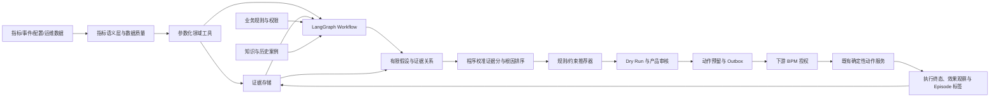

# 城市异动诊断 Agent：数据、工具与模型策略

> 状态：下一阶段技术规划
>
> 当前事实：尚未建设城市经营数据工具、MCP、诊断样本、证据库或微调模型。
>
> 设计原则：实时事实来自工具，业务约束来自程序，历史经验来自可审核知识库，LLM 只处理难以完全规则化的推理与表达。

## 1. 总体分工



关键边界：

- 检测时序异常：规则、统计或轻量 ML；
- 解释异常并设计取证顺序：LLM Planner；
- 获取事实：只读领域工具；
- 判断数据是否有效：数据契约与确定性质量规则；
- 决定阈值数值：规则/约束优化器，LLM 只能给理由和候选方向；
- 决定能否写生产：产品审核、下游 BPM、权限、业务规则、版本保护与执行前重验共同控制；
- 判断是否有效：预注册效果窗、对照和统计分析；
- 总结给人看：LLM，但每个数字必须绑定证据。

## 2. 数据域规划

下面是逻辑数据域，不代表要把所有原始表复制进 Agent，也不应把公司表名写入个人仓库。

| 数据域 | 核心问题 | 建议最小字段 | 刷新与质量要求 |
|---|---|---|---|
| 供需/履约 | 需求是否突增、供给是否跟上、履约是否恶化 | Scope、事件时间、需求量、完成量、取消量、等待/时效、分子分母 | 明确事件时间与处理时间；分母为零必须显式标记 |
| 车辆状态 | 可用车、低电车和空间分布是否异常 | 城市/区域/车型、车辆状态、数量、电量桶、快照时间 | 快照去重；同一车辆状态口径唯一 |
| 换电/运维能力 | 是否是人员、站点、设备或处理能力瓶颈 | 站点/区域、任务到达、完成量、容量、故障、人员、积压 | 故障和能力数据允许 UNKNOWN，不得默认正常 |
| 工单 | 运营压力和处理漏斗是否异常 | 创建/接单/完成时间、类型、Scope、状态、积压 | 时间字段语义固定；跨天和未完成工单单独处理 |
| 阈值与策略配置 | 当前配置、历史变更与近期策略是否相关 | Scope、配置项、值、版本、生效时间、修改来源 | 每次建议生成和执行前分别读取并比较版本 |
| 服务/发布 | 是否为系统故障或发布回归 | 服务、版本、发布窗口、错误率、延迟、事故状态 | 仅注入与案件时间和依赖相关的摘要 |
| 天气/节假日/活动 | 外部环境能否解释异常 | 城市、时间、类型、强度、来源、更新时间 | 外部源不可用时标记 UNKNOWN；不凭常识补全 |
| 组织与权限 | 谁可以看、建议和审批哪个 Scope | 主体、角色、业务线、城市范围、动作权限 | 权限在每次工具和动作内部再次检查 |
| 案件与决策 | 当时看到了什么、做了什么、后来怎样 | Episode、Evidence、Recommendation、Decision、Execution、Outcome | 事件溯源，版本化且不可静默覆盖 |

## 3. 指标语义层

Agent 最大的现实风险通常不是“模型不聪明”，而是不同工具对同一指标使用了不同口径。首版必须先建立轻量指标注册表。

### 3.1 每个指标的契约

```yaml
metric_key: low_battery_vehicle_ratio
display_name: 脱敏展示名
description: 业务含义
formula:
  numerator: 分子定义
  denominator: 分母定义
unit: ratio
grain: city_area_vehicle_type_15m
event_time: 业务事件时间字段语义
available_at: 该记录首次能够被诊断系统读取的时间字段语义
ingested_at: 记录进入当前 Serving/湖仓层的时间字段语义
timezone: Asia/Shanghai
freshness_sla: 数据刷新承诺
allowed_lateness: 用于判断数据是否迟到和触发 DQ 的阈值，不能放宽时点可见性
minimum_sample: 最小分母
default_baseline: 同星期同时间段过去若干周
owner: 数据/业务负责人角色
quality_checks:
  - not_null
  - denominator_positive
  - uniqueness
  - cross_source_reconcile
version: metric_v1
```

### 3.2 必须避免的口径错误

- 把行数当车辆数或工单数，未按主键去重；
- 用处理时间切窗，却声称是事件发生时间；
- 比率只存最终数值，不保留分子与分母；
- 当前窗口和基线窗口的城市、车型或星期条件不同；
- 在低样本 Scope 上报巨大百分比变化；
- 数据尚未完成时把缺失当作业务骤降；
- 用全城平均掩盖局部区域异常；
- 在事后回放时使用了 T0 之后才产生或才进入系统的数据；
- 只检查 `event_time`，却忽略该记录在当时尚未到达系统；
- 把 `allowed_lateness` 误解成允许将迟到数据补进历史决策输入。

## 4. 数据质量闸门

任何诊断必须先经过 DQ Gate。建议输出：

```yaml
status: PASS | DEGRADED | FAIL
watermark: 数据截止时间
expected_watermark: 预期截止时间
freshness_lag_seconds: 具体延迟
checks:
  - check: completeness
    status: PASS
    observed: 0.997
    threshold: 0.99
  - check: denominator
    status: PASS
  - check: cross_source_reconcile
    status: DEGRADED
quality_flags: []
allowed_actions:
  - READ_ONLY_DIAGNOSIS
blocked_actions:
  - THRESHOLD_RECOMMENDATION
```

建议规则：

- `FAIL`：停止业务根因推断，转成数据质量案件；
- `DEGRADED`：允许展示确定性事实，但不允许给高风险建议；
- `PASS`：进入异常确认；
- 数据在诊断中途过期：标记状态变化，已有结论必须重新校验；
- 不同数据域分别判断水位，不能因为一个来源新鲜就默认全部新鲜。
- `allowed_lateness` 只决定迟到率、完整性和 `PASS/DEGRADED/FAIL`，不决定一条记录能否进入某次历史决策；
- 对实时诊断和离线回放使用同一可见性谓词：`event_time <= decision_cutoff` 且 `available_at/ingested_at <= decision_cutoff`。任一条件不满足，该记录只能用于事后 Outcome 或数据延迟分析。

## 5. 可重放 Episode 数据契约

### 5.1 核心原则

每个异常以 `anomaly_episode_id` 为主键，固定触发时刻 `T0`，并固化本轮诊断的 `decision_cutoff`。实时诊断和离线重放都必须执行严格的 point-in-time join：只有同时满足 `event_time <= decision_cutoff` 且 `available_at/ingested_at <= decision_cutoff` 的记录，才能成为本轮 Evidence。`allowed_lateness` 只用于数据质量判定，绝不能作为纳入迟到数据的例外。`decision_cutoff` 之后才产生或才可读取的数据只能进入 Outcome、延迟归因或后验复盘，不能反向污染诊断证据。

### 5.2 八个逻辑实体

#### `episode`

```yaml
episode_id: 脱敏唯一标识
trigger_time: T0
trigger_source: detector | manual | schedule
scope: 城市/区域/车型/时段的脱敏键
severity: S0 | S1 | S2 | S3 | DQ
detector_version: 版本
metric_contract_version: 版本
decision_cutoff: 本轮决策可见数据截止时间
status: 产品查询投影；枚举映射以 02 的 Workflow 状态契约为准，不作为运行时事实源
```

#### `metric_snapshot`

- 当前值、分子、分母、单位；
- 基线值、基线方法和置信区间；
- 环比/同比/季节性偏差；
- 样本量、缺失率、数据截止时间；
- 事件时间最大值、首次可用/入仓时间最大值与 `decision_cutoff`；
- 检测器输入特征与版本；
- 查询指纹与结果哈希。

#### `evidence`

```yaml
evidence_id: 不可变引用
episode_id: 所属案件
tool_name: 领域工具名
tool_version: Schema 与实现版本
query_fingerprint: 参数摘要哈希
scope: 查询范围
time_window: 查询窗口
observed_at: 数据截止时间
event_time_max: 本结果中最大的业务事件时间
available_at_max: 本结果中最大的首次可读时间；无该字段时为 null
ingested_at_max: 本结果中最大的入仓时间；无该字段时为 null
decision_cutoff: 本轮决策截止时间
point_in_time_check: PASS | FAIL
summary: 给模型的高信号摘要
artifact_ref: 受控原始结果引用
quality_flags: []
truncated: false
```

Evidence 只记录“查询得到了什么事实、在什么时间可见、质量如何”，不直接携带“支持/反驳哪个假设”的立场。事实与推断解耦，才能在假设改变时复用同一份不可变证据，也避免模型把自己的判断写回事实层。

#### `evidence_hypothesis_relation`

```yaml
relation_id: 不可变引用
episode_id: 所属案件
evidence_id: 只引用已经通过时点可见性与 DQ 校验的 Evidence
hypothesis_id: 被评估的假设
stance: supports | contradicts | neutral | insufficient
claim: 对证据关系的简短可审计说明
strength_features: 由程序提取的覆盖、独立来源、冲突和质量特征
proposed_by: model | rule | expert
verified_by: deterministic_check | expert | pending
relation_version: 版本
```

`stance` 可以由模型提出，但必须经过 Schema、引用完整性和确定性规则校验；涉及关键动作的关系还需专家确认。它是“证据—假设关系”，不是 Evidence 本身的属性。

#### `expert_label`

- 是否真实异常；
- 影响 Scope 与严重度；
- 多标签根因、主因/辅因；
- 关键支持和反证；
- 是否可行动、是否应拒答；
- 允许动作集合、方向、区间和禁止组合；
- 标注人、仲裁人、标注规范版本和一致性。

#### `recommendation`

- 版本化的动作类型、目标 Scope 和理由；
- 当前值、候选方向/区间/值；
- 规则/优化器、Prompt、模型与 Workflow 版本；
- 证据、风险、前置条件、观察窗和回滚条件；
- Dry Run、Diff 和配置版本；
- 候选状态：draft/validated/review_pending/reviewed/rejected/superseded；产品审核、下游审批和执行终态使用独立字段，不能用一个 `approved` 代替。

#### `decision_execution`

- 人工查看、编辑、拒绝或补证，以及所绑定的不可变候选版本；
- 产品建议审核与下游审批分别记录；
- 持久化幂等键；
- 下游审批 submitted/pending/approved/rejected/expired；
- 执行 applying/applied/failed/partial/unknown、错误分类、影响范围和最终回查；
- 配置版本冲突、部分成功、补偿和回滚；
- 审批终态与执行终态必须是不同字段。

#### `outcome`

- 预注册的 T+30m/T+2h/T+6h/T+24h 或业务确认窗口；
- Primary/Guardrail Metric 的绝对值、相对基线和置信区间；
- 同期控制组或匹配组；
- 同时发生的人工动作、发布、天气和活动；
- 是否恢复、是否回滚、是否有延迟副作用；
- 因果结论等级：descriptive/associational/quasi-experimental/experimental。

## 6. 工具设计总原则

### 6.1 不提供任意 SQL 工具

不能给模型 `execute_sql(sql)`，而应提供语义清晰、参数化的领域工具：

```text
metric.get_anomaly_snapshot
metric.compare_baseline
supply.get_summary
demand.get_summary
operation.get_capacity_fault_summary
configuration.get_current_snapshot
history.search_similar_cases
knowledge.get_approved_playbook
simulation.preview_threshold_change
notification.render_draft
monitor.get_post_action_effect
```

这是首版唯一的模型可调用注册表。每个工具都应解决一个可评测的业务决策，并避免功能高度重叠。其中 `simulation.preview_threshold_change` 只能做无副作用模拟；`notification.render_draft` 只渲染未发送、未持久化的草稿内容；`monitor.get_post_action_effect` 只读后验指标。审批提交、动作执行、回滚与执行状态查询均不注册为 LLM/MCP 工具，而由应用侧确定性 Action Adapter 完成。

### 6.2 标准工具元数据

模型可见的 MCP `ToolDefinition` 与应用内部的运行/治理元数据必须分开。前者描述模型可以怎样调用工具，例如：

```json
{
  "name": "metric.compare_baseline",
  "title": "比较指标与固定基线",
  "description": "比较指定 Scope 当前窗口与固定基线窗口，只返回事实，不推断根因。",
  "inputSchema": {
    "type": "object",
    "additionalProperties": false,
    "required": ["scope", "metric_key", "current_window", "baseline_strategy"],
    "properties": {
      "scope": {
        "type": "object",
        "additionalProperties": false,
        "required": ["city_key"],
        "properties": {
          "city_key": {"type": "string"},
          "area_key": {"type": ["string", "null"]},
          "vehicle_type": {"type": ["string", "null"]}
        }
      },
      "metric_key": {"type": "string"},
      "current_window": {
        "type": "object",
        "additionalProperties": false,
        "required": ["start", "end"],
        "properties": {
          "start": {"type": "string", "format": "date-time"},
          "end": {"type": "string", "format": "date-time"}
        }
      },
      "baseline_strategy": {"type": "string"}
    }
  },
  "outputSchema": {
    "type": "object",
    "additionalProperties": false,
    "required": ["status", "observed_at", "decision_cutoff", "event_time_max", "availability_time_max", "metric_version", "current", "baseline", "deviation", "quality_flags", "truncated", "query_id", "evidence_id"],
    "properties": {
      "status": {"enum": ["OK", "NO_DATA", "STALE", "DEGRADED"]},
      "observed_at": {"type": "string", "format": "date-time"},
      "decision_cutoff": {"type": "string", "format": "date-time"},
      "event_time_max": {"type": "string", "format": "date-time"},
      "availability_time_max": {"type": "string", "format": "date-time", "description": "available_at 或 ingested_at 的规范化可见时间"},
      "metric_version": {"type": "string"},
      "current": {
        "type": "object",
        "additionalProperties": false,
        "required": ["numerator", "denominator", "value"],
        "properties": {
          "numerator": {"type": "number"},
          "denominator": {"type": "number"},
          "value": {"type": "number"}
        }
      },
      "baseline": {
        "type": "object",
        "additionalProperties": false,
        "required": ["value", "lower", "upper"],
        "properties": {
          "value": {"type": "number"},
          "lower": {"type": "number"},
          "upper": {"type": "number"}
        }
      },
      "deviation": {
        "type": "object",
        "additionalProperties": false,
        "required": ["absolute", "relative", "robust_z"],
        "properties": {
          "absolute": {"type": "number"},
          "relative": {"type": "number"},
          "robust_z": {"type": "number"}
        }
      },
      "quality_flags": {"type": "array", "items": {"type": "string"}},
      "truncated": {"type": "boolean"},
      "query_id": {"type": "string"},
      "evidence_id": {"type": "string"}
    }
  },
  "annotations": {
    "readOnlyHint": true,
    "destructiveHint": false,
    "idempotentHint": true,
    "openWorldHint": false
  }
}
```

超时、重试、数据权限与扫描预算等属于应用侧 Registry/Policy，不靠模型可见描述执行：

```yaml
name: metric.compare_baseline
definition_version: v1
risk_tier: read_only
authz_resource: metric
authz_action: read
business_scope_resolver: trusted_principal_to_allowed_scope
timeout_ms: 3000
max_retries: 2
cache_ttl_seconds: 60
max_time_range: 14d
max_rows: 500
owner: metric-platform
```

MCP `ToolAnnotations` 只是向客户端和模型提供行为提示，不能作为安全证明。即便 `readOnlyHint=true`、`destructiveHint=false` 或 `idempotentHint=true`，服务端仍必须按真实实现执行鉴权、参数限制、资源预算与审计；客户端也不应据此自动授予权限。

每个工具必须：

- 严格定义 `inputSchema`/`outputSchema`，禁止未声明字段；
- 明确单位、枚举、时区、时间窗口和默认值；
- 工具内部再次做身份、Scope 和动作权限检查；
- 限制最大跨度、扫描量、返回行数、并发、超时和重试；
- 返回数据截止时间、质量标记、查询指纹、是否截断；
- 区分参数错误、无权限、无数据、数据过期、上游失败和超时；
- 不把错误页面、SQL 堆栈或内部信息原样交给模型；
- 输出摘要与完整受控 Artifact 分离，避免上下文膨胀。

### 6.3 只读工具的调用与返回示例

上一节是完整的工具定义；下面第一段是一次工具调用请求，不是 `ToolDefinition`：

```json
{
  "name": "metric.compare_baseline",
  "input": {
    "scope": {
      "city_key": "city_x",
      "area_key": "area_y",
      "vehicle_type": "type_a"
    },
    "metric_key": "low_battery_vehicle_ratio",
    "current_window": {
      "start": "2026-09-04T08:00:00+08:00",
      "end": "2026-09-04T09:00:00+08:00"
    },
    "baseline_strategy": "same_weekday_same_slot_4w"
  }
}
```

下面是该次调用的结果：

```json
{
  "status": "OK",
  "observed_at": "2026-09-04T09:05:00+08:00",
  "decision_cutoff": "2026-09-04T09:05:00+08:00",
  "event_time_max": "2026-09-04T09:00:00+08:00",
  "availability_time_max": "2026-09-04T09:04:00+08:00",
  "metric_version": "metric_v1",
  "current": {"numerator": 120, "denominator": 1000, "value": 0.12},
  "baseline": {"value": 0.08, "lower": 0.072, "upper": 0.089},
  "deviation": {"absolute": 0.04, "relative": 0.5, "robust_z": 3.2},
  "quality_flags": [],
  "truncated": false,
  "query_id": "query_ref",
  "evidence_id": "ev_ref"
}
```

注意：示例数值仅用于说明调用/返回契约，不代表真实业务数据或目标。

### 6.4 Action Adapter：动作永不暴露为模型工具

生产动作不是“高风险 LLM 工具”，而是完全不进入模型/MCP 注册表。LLM 只能生成无数值、无授权语义的建议草稿；确定性推荐器生成候选值，产品审核决定是否允许创建动作预留。之后应用侧才从可信状态库组装 Action Adapter 命令并提交下游 BPM；只有下游审批通过、配置版本仍有效且规则重验通过，才能进入真实执行。

模型可见 Schema 中不得出现 `approved_by`、`approval_ref`、`idempotency_key`、`expected_config_version`、`dry_run_hash` 等可信字段，避免模型伪造或让调用者误以为“填了字段就已获授权”。这些值分别由服务端从案件 Checkpoint、推荐版本库、配置服务、Dry Run 记录和审批系统读取，幂等键也由服务端生成。

应用内部流程固定为：

```text
已验证建议
→ 确定性资格/边界校验
→ 产品审核查看不可变 Diff，可批准/编辑/拒绝/补证
→ 批准后服务端原子创建动作预留与 Outbox，并生成幂等键
→ Action Adapter 可靠提交下游 BPM
→ 下游审批回执进入 Inbox，并与建议版本、Diff、配置版本绑定
→ 下游批准后 Action Adapter 做权限、CAS 与规则重验，再调用确定性执行器
→ 最终回查、审计、补偿/回滚
```

`reserve_action/submit_for_approval/apply/get_execution_status/create_rollback_candidate` 是应用内部方法，只接受服务端可信上下文，不是模型工具。人工编辑必须产生新建议版本并使旧审核失效；回滚也先生成独立候选，不能由模型自动执行。模型或 Workflow 前面已经校验过，也不是 Action Adapter 放弃身份、业务对象权限、审批有效性、幂等、版本 CAS 和规则重验的理由。

## 7. Hive/数仓工具落地方式

### 7.1 首版架构

```text
LLM / Workflow
  → 参数化领域工具
  → 工具服务权限、限流、Schema 校验
  → 服务端 SQL 模板 / 指标服务
  → Hive/湖仓或预聚合 Serving 层
  → 结果摘要 + Evidence 引用
```

首版只允许服务端模板生成查询，模型填写指标、Scope、时间窗和下钻维度。不要把任意 SQL 作为“灵活性”暴露给 Agent。

### 7.2 查询安全

- 只读服务账号和最小数据权限；
- 库/数据集、指标和维度白名单；
- 必须命中时间分区；
- 最大扫描量、最大执行时间和最大返回行数；
- Query Cost 预估，超预算转异步或拒绝；
- 结果脱敏、行列级权限和目的绑定；
- 查询参数、模板版本、数据水位和结果哈希审计；
- 禁止模型直接拼接标识符或 WHERE 文本；
- 大结果写入 Evidence Store，模型只看统计摘要；
- 深查询走低优先级队列，不阻塞快速诊断。

### 7.3 为什么仍可以使用 MCP

MCP 可以统一工具发现、结构化输入输出和客户端接入。其授权规范解决的是客户端访问 MCP Resource Server 的传输层授权，包括受保护资源发现、Token 受众绑定和 Scope 协商；它不替代业务对象级授权，也不会自动回答“这个人能否查看这个城市、指标、数据集、行列或执行这类动作”。

应用网关必须从已认证会话注入可信 Principal、Tenant/业务线和允许的 Scope，领域工具再按城市、数据域、指标、行列和目的做服务端对象级检查；模型传入的 `city_key` 或 `scope` 只是请求参数，不能作为授权依据。Token 不能透传给下游非 MCP 服务，工具也不能把自己的凭据交给模型。即使 ToolAnnotations 声称只读，仍须以真实服务端策略为准。

截至 2026-09-04，应以 [MCP 2026-07-28 规范](https://modelcontextprotocol.io/specification/2026-07-28) 为实现前核对入口，并分别核对 [MCP Authorization](https://modelcontextprotocol.io/specification/2026-07-28/basic/authorization) 与 [MCP Authorization Security Considerations](https://modelcontextprotocol.io/specification/2026-07-28/basic/authorization/security-considerations)。授权实现需遵守受众绑定、最小权限、禁止 Token Passthrough，并把业务对象级权限继续留在应用工具网关内。

如果工具与既有 Java 生态更贴近，可以用 Spring AI 提供 MCP/Tool 接口，但业务代码仍由应用执行，模型只提出工具调用请求。参考 [Spring AI Tool Calling](https://docs.spring.io/spring-ai/reference/api/tools.html) 和 [Spring AI MCP Overview](https://docs.spring.io/spring-ai/reference/api/mcp/mcp-overview.html)。Spring AI 官方文档提示 HTTP MCP Server 默认不自动获得完整安全保护，因此部署时必须显式加入认证授权层，不能裸露。参考 [Spring AI MCP Server Security](https://docs.spring.io/spring-ai/reference/api/mcp/mcp-server-boot-starter-docs.html)。

## 8. 证据存储与引用

### 8.1 三层结果

每次工具调用保存三类内容：

1. `raw_artifact`：受访问控制的原始/聚合结果，供审计和复现；
2. `normalized_evidence`：统一 Schema、单位、时间和质量字段；
3. `model_summary`：只保留当前假设需要的高信号摘要。

LLM 只能引用 `evidence_id`，不能在报告里凭空新增一个没有来源的数字。证据事实与证据立场分别写入 `evidence` 和 `evidence_hypothesis_relation`：前者不可变，后者可以随着新假设、新证据或专家复核而版本化。生成报告后执行程序化检查：每个数值、时间点和配置值能否映射到 Evidence，每个根因判断能否映射到已校验的关系；无法映射就删除或将报告标为不合格。

### 8.2 证据冲突

如果两个来源冲突：

- 不用模型投票决定“哪个是真的”；
- 按数据 owner、口径版本、新鲜度和对账规则排序；
- 保留两条 Evidence 和冲突说明；
- 对关键字段冲突时触发 DQ/ABSTAIN；
- 把冲突样本加入安全评测集。

## 9. Knowledge 与 Case Memory

### 9.1 四类上下文不能混在一起

| 层 | 内容 | 生命周期 | 是否直接作为事实 |
|---|---|---|---|
| Graph State | 当前案件节点、控制状态、模型假设、引用和预算 | 单案件 | 否；它是事实、推断与控制字段的混合容器 |
| Evidence Store | 本次查询快照和 Artifact | 长期审计 | 仅通过时点可见性与 DQ 校验的 Evidence 是事实 |
| Knowledge Store | 指标口径、规则、Playbook、权限说明 | 人工维护 | 规范性知识，需版本和 owner |
| Case Memory | 历史案件摘要、动作和后验结果 | 跨案件 | 仅作类比，不能覆盖当前证据 |

Graph State 本身不是证据：其中的 `hypothesis`、`next_node`、预算、模型摘要和路由分数都可能是推断或控制信息。只有 State 内引用的不可变 Evidence，且满足本轮 `decision_cutoff` 与质量规则时，才能支撑事实陈述；State Checkpoint 只负责恢复执行和审计过程。

成熟的 Context Engineering 不是无限堆聊天历史，而是让每个节点只看到完成当前任务所需的最小上下文。参考 [Anthropic Context Engineering](https://www.anthropic.com/engineering/effective-context-engineering-for-ai-agents)。

### 9.2 历史相似案件检索

检索过滤建议包括：

- Scope 类型与城市规模分层；
- 异常指标和根因标签；
- 季节、时间段和严重度；
- 数据质量状态；
- 是否执行动作以及后验结果；
- 策略/指标版本。

返回时必须展示“相似在哪里、不相似在哪里、当时动作是否真正有效”。不能只因为文本相似就复制历史阈值。

## 10. 模型分工与路由

### 10.1 首版模型角色

| 任务 | 首版实现 | 原因 |
|---|---|---|
| Scope/意图解析 | 小模型结构化输出 + 规则校验 | 低成本、可评测，错了可以明确拒绝 |
| 异常检测 | 规则/统计/轻量 ML | 时序、分母和季节性应确定性处理 |
| 诊断计划 | 强模型，最多 3 个假设 | 需要跨域推理，但严格限制搜索空间 |
| 证据压缩 | 小模型或模板 | 原始事实仍保存在 Evidence Store |
| 假设验证/反证 | 强模型提出证据关系 + 程序计算校准证据分 | 允许处理冲突，但不能改写原始数据或自报最终置信度 |
| 根因排序 | 规则特征 + 模型结构化判断 | 支持多标签和 ABSTAIN |
| 候选阈值 | 规则/约束优化器 | 数值、边界和冲突不能靠自由生成 |
| 风险与权限 | 程序 | 安全不依赖模型自觉 |
| 人类报告 | 小/强模型按复杂度路由 | 只总结已绑定的事实和建议 |

### 10.2 路由规则

- 简单、单根因、证据一致：小模型完成摘要；
- 多根因、证据冲突或跨域：强模型执行 Planner/Verifier；
- 关键数据缺失：不升级更强模型“猜”，而是 ABSTAIN；
- 模型超时：返回确定性异常摘要和已收集证据；
- 达到 Token/工具/循环预算：停止并说明剩余缺口；
- 涉及安全规则：不调用模型作最终裁决。

### 10.3 用校准证据分路由，不用模型自报置信度

模型输出的 `high/medium/low` 或自然语言自信程度不具备稳定概率含义，不能直接决定自动建议、人工复核或拒答。Verifier 只提出 Evidence 与 Hypothesis 的关系；随后由确定性评分服务计算 `evidence_score`，再将其映射到路由。

首版分数特征建议包括：

- DQ 状态、数据新鲜度和 point-in-time 可见性；
- 关键证据覆盖率、来源独立性和查询是否截断；
- 支持证据与反证的数量、强度和口径一致性；
- 当前值相对置信区间/稳健基线的偏离程度与样本量；
- 工具错误、缺失域、OOD 城市/时段和历史分布漂移；
- 规则校验、专家复核或确定性对账是否通过。

在时序盲测集上用逻辑校准、等距回归等方法把原始分数映射为经验正确率，并冻结版本。阈值不凭感觉指定，而是看 risk-coverage 曲线：高分区才允许进入确定性推荐器，中间区进入人工补证，低分区 `ABSTAIN`。至少报告 Brier Score、ECE、覆盖率—错误率曲线、各城市/根因/DQ 切片表现和 Bootstrap 95% CI；上线后监控校准漂移。任何模型自报 confidence 最多作为实验特征，不能单独改变权限或动作路径。

## 11. 提示词与结构化输出

### 11.1 Planner 的最小职责

Planner 只能：

1. 根据已确认异常和 taxonomy 提出最多 3 个假设；
2. 为每个假设选择允许的只读工具和参数；
3. 给出能支持或推翻假设的预期证据；
4. 明确停止条件和缺失数据。

它不能：

- 自己计算未经工具返回的业务数字；
- 请求开放 SQL 或写工具；
- 把历史案例当作当前事实；
- 在证据不足时强制选根因；
- 直接给最终阈值数值。

### 11.2 Verifier 的输出

```yaml
hypothesis_id: h1
status: supported | weakened | contradicted | unresolved
supporting_evidence: [ev1, ev2]
counter_evidence: [ev3]
missing_evidence: []
reasoning_summary: 只描述证据关系，不暴露或依赖隐式思维链
next_action: rank | gather_more | abstain
```

模型输出必须经过 Pydantic/JSON Schema、Evidence 引用完整性和关系规则校验，再转换成版本化的 `evidence_hypothesis_relation`。模型不输出有路由权限的置信等级；`evidence_score` 由 10.3 的程序服务计算。结构失败可以做一次带错误信息的修复；再次失败就降级，不无限重试。

## 12. 阈值推荐器设计

### 12.1 首版不是“让 LLM 算一个值”

LLM 在这一步只能产生非约束性的方向与理由草稿：

```yaml
suggested_direction: increase | decrease | hold
rationale: 只解释为什么，不生成阈值数字
```

该 Schema 不含 `candidate_range`、`recommended_value`、审批、幂等或配置写入字段。方向也只是输入信号，程序可以因硬约束、证据分不足或近期变更而改为 `hold`。确定性推荐器的输入为：

- 当前值和配置版本；
- 异常 Scope 与时间窗；
- 已验证根因和证据；
- 业务上下限、单次最大变化、冷却期；
- 在途审批和近期变更；
- 可选历史响应曲线与资源约束。

确定性推荐器输出：

```yaml
eligible: true | false
direction: increase | decrease | hold
candidate_range: [lower, upper]
recommended_value: 确定性规则选择的值
constraints_applied: []
blocked_by: []
expected_effect: 预测区间，不是保证
guardrails: []
observation_window: []
rollback_condition: []
optimizer_version: v1
```

候选区间和值必须由规则、响应曲线或约束优化器计算并可复现，相同输入与版本应得到相同结果。LLM 负责方向假设和可读理由，不参与数值运算，也不能把自然语言建议直接送往 Action Adapter。

### 12.2 演进路线

1. 规则版：专家给范围、最大步长、冷却和适用根因；
2. 回放版：历史 Episode 上验证方向和安全边界；
3. 响应曲线版：在足够自然实验/灰度数据上估计边际响应；
4. 约束优化版：目标函数包含主指标、Guardrail、变更成本和不确定性；
5. 个性化版：按城市/规模分层，但保留全局硬约束和保守回退。

任何学习型推荐器都必须输出不确定性，并能回退到规则版或不行动。

## 13. 是否需要微调

### 13.1 当前结论

【规划门槛】首版不做微调。当前没有城市诊断训练集，也没有证据表明通用模型的主要瓶颈是参数能力。更可能的瓶颈是数据口径、工具设计、上下文污染、权限、状态恢复和评测缺失。

优先级应是：

```text
评测集
→ 数据与工具契约
→ 确定性规则和异常检测
→ Context/Prompt/Schema
→ Badcase 聚类
→ 证明存在稳定模型错误
→ 再评估 SFT/LoRA 或蒸馏
```

### 13.2 微调触发条件

样本条数只能作为项目资源预算，不能作为“达到数量就应该微调”的技术结论。首轮与扩展阶段的标注预算统一在[评测文档第 8 节](04-评测灰度SLO与量化目标.md#8-微调模型的触发条件与评测)维护；是否继续投入由以下证据共同决定：

- 在固定基座模型、Prompt、工具和规则版本后，仍存在稳定、可重复且能由参数学习解决的错误簇；
- 覆盖正常负例、未知、多根因、数据异常和跨城市/跨时间样本；
- 关键类别至少有足够独立样本，不能只有个位数；
- 标注一致性达到既定门槛；
- 该错误确实能由训练解决，而不是缺实时数据或规则；
- 有严格时序/城市盲测集和安全集；
- 能明确衡量微调带来的质量、延迟或成本收益；
- 分阶段训练的学习曲线仍显示有效边际收益，而不是误差已经饱和。

具体决策方法：预先冻结盲测集，以逐步增加且互斥去重的训练样本做离线学习曲线试验，绘制总体和关键切片的学习曲线；每个点报告 Bootstrap 95% CI，并比较基础模型、Workflow 基线和微调候选。只有当核心错误改善的置信区间达到预注册最小效果、Critical 安全错误仍为 0、OOD 切片不退化，且新增标注的边际收益仍值得成本时才扩样。若曲线变平、置信区间持续跨 0、错误主要来自缺数据/规则，或 Badcase 已进入不可学习噪声，就停止微调投入并回到工具与规则修复。

第二阶段是否扩样不是生产微调的必要或充分条件；实际停止点由学习曲线、置信区间、关键错误饱和情况、覆盖度和单位标注收益决定。

### 13.3 适合微调的任务

- Scope 与异常类型分类；
- 受限工具选择和结构化参数生成；
- 根因候选排序；
- 标准化案件摘要；
- 把大模型已验证策略蒸馏给小模型以降低延迟/成本。

### 13.4 不适合通过微调解决

- 当前实时指标和配置；
- 数据新鲜度与查询结果；
- 认证、授权和城市权限；
- 阈值上下限、冷却期和版本冲突；
- 审批、幂等、事务和回滚；
- 因果业务收益；
- 极少见但高危的生产动作规则。

### 13.5 微调验收

微调候选至少应在盲测中满足[评测文档第 8.3 节](04-评测灰度SLO与量化目标.md#83-微调-gono-go)冻结的 Go/No-Go 数字，并同时做到：

- 端到端任务成功率不下降；
- Critical 安全错误仍为 0；
- 跨城市、跨时间 OOD 切片不下降；
- 延迟或成本相对强模型达到预注册收益门槛；
- 若收益不满足，就保留基础模型 + Workflow，不为了简历强行上线微调。

早期不建议 RL：奖励稀疏、处置结果受运营和外部环境强混杂，容易学到“更常建议”而不是真正更有效。偏好优化也只有在积累大量一致、可解释的专家偏好对后才有意义。

## 14. 数据集构建

### 14.1 Gold Set

首轮 Gold Set 的样本预算、切分与双标比例统一以[评测文档第 6 节](04-评测灰度SLO与量化目标.md#6-gold-set安全集与数据切分)为准，实际数量由标签覆盖、学习曲线和置信区间决定：

- 按城市规模、时段、严重度和根因分层；
- 包含真实异常和 quiet negative；
- 包含无需调阈值、只需运维处置的案例；
- 包含多根因、根因未知和证据冲突；
- 锁定时序盲测，不参与 Prompt/规则调优；
- 按预注册比例进行双人独立标注，由资深专家仲裁；
- 记录每个标签的 prevalence、分歧类型、仲裁结果和规范版本。

根因是多标签任务，不能用一个总体 κ 概括一致性。两位标注者按每个标签分别报告 Cohen's κ；三位及以上标注者可按每个标签报告 Fleiss' κ，存在缺失标注、不同标注人数或更复杂尺度时优先使用 Krippendorff's α。同时报告样本级 Jaccard、micro/macro F1、Exact Set Match、原始一致率及 Bootstrap 95% CI。`是否行动` 作为独立二分类/多分类任务单独计算 Cohen/Fleiss κ 或 Krippendorff's α。正式阈值要在标注试运行后结合标签基率预注册；低频标签即便原始一致率很高也可能 κ 不稳定，不能只看单一数值。低于门槛时先修标注规范、拆分含混标签并重新双标，而不是直接训练。

### 14.2 安全与故障集

安全与故障集的最低样本数只在评测文档维护；内容至少覆盖：

- 数据过期、分母为零、指标冲突；
- 伪造城市/区域、越权 Scope；
- Prompt Injection 和工具输出中的恶意文本；
- 极端批量或超长时间窗；
- 配置版本在审批期间变化；
- 重复回调、重复提交、部分成功；
- 工具超时、错误 Schema、截断和结果变化；
- 模型超预算或结构化输出失败。

可以用故障注入补安全集，但合成样本不能计入真实业务诊断准确率。

### 14.3 数据切分与泄漏防护

- 先按时间切训练/验证/盲测，再检查城市泄漏；
- 评估跨城市泛化时整城留出；
- 同一异常的重复告警必须落在同一 split；
- 历史相似案件库不能检索到当前测试 Episode 的事后总结；
- 只使用满足 `event_time <= decision_cutoff` 且 `available_at/ingested_at <= decision_cutoff` 的 Feature；`allowed_lateness` 只进入 DQ 标签，Outcome 单独存放；
- Prompt、工具和规则每次变化都记录版本；
- 评测结果按城市规模、根因、严重度和数据质量切片。

## 15. 数据与模型漂移

每周至少检查：

- 指标分布、缺失率和数据水位；
- 告警率、根因分布、ABSTAIN 和工具错误；
- 专家编辑/拒绝原因；
- Evidence 引用错误和结构化输出失败；
- 大小模型路由比例、Token、成本和延迟；
- 城市/根因切片的质量退化；
- 新策略、指标口径和业务流程是否改变了标签含义。

发现漂移时先回归数据、工具、口径和规则，不自动用线上反馈更新模型。任何模型更新都要过固定锚点集、时序盲测集和安全集。

## 16. 实施检查清单

### 数据接入前

- [ ] 每个指标有 owner、公式、分子分母、单位、粒度和刷新 SLA；
- [ ] 确认事件时间、`available_at/ingested_at`、`decision_cutoff` 和 allowed lateness，且 allowed lateness 不放宽纳入条件；
- [ ] 数据权限和保留周期完成评审；
- [ ] T0 快照可以保存和脱敏重放；
- [ ] 正常负例和未知类纳入数据集。

### 工具上线前

- [ ] Schema 严格且版本化；
- [ ] 权限在工具内部验证；
- [ ] 查询范围、扫描量、行数、超时和并发有限制；
- [ ] 输出包含 observed_at、quality_flags、query_id、truncated；
- [ ] 模型工具注册表只包含 6.1 的固定工具，ToolAnnotations 未被当作授权依据；
- [ ] 生产写入只经应用侧 Action Adapter，审批、幂等、版本和 Dry Run 引用均由服务端可信状态派生；
- [ ] Tool 注入、越权、超时和错误结果已进入安全测试。

### 模型变更前

- [ ] 错误簇来自真实 Badcase，而非主观感觉；
- [ ] 先尝试工具/口径/Prompt/Schema 修复；
- [ ] 固定盲测和安全集未被训练污染；
- [ ] 对质量、延迟、成本和跨切片稳定性同时比较；
- [ ] 不把微调候选直接赋予更多生产权限。

## 17. 官方参考

- [MCP 2026-07-28 specification](https://modelcontextprotocol.io/specification/2026-07-28)
- [MCP authorization](https://modelcontextprotocol.io/specification/2026-07-28/basic/authorization)
- [MCP authorization security considerations](https://modelcontextprotocol.io/specification/2026-07-28/basic/authorization/security-considerations)
- [MCP tools and ToolAnnotations](https://modelcontextprotocol.io/specification/2026-07-28/server/tools)
- [Spring AI Tool Calling](https://docs.spring.io/spring-ai/reference/api/tools.html)
- [Spring AI MCP Overview](https://docs.spring.io/spring-ai/reference/api/mcp/mcp-overview.html)
- [Anthropic: Writing effective tools for agents](https://www.anthropic.com/engineering/writing-tools-for-agents)
- [Anthropic: Effective context engineering for AI agents](https://www.anthropic.com/engineering/effective-context-engineering-for-ai-agents)
