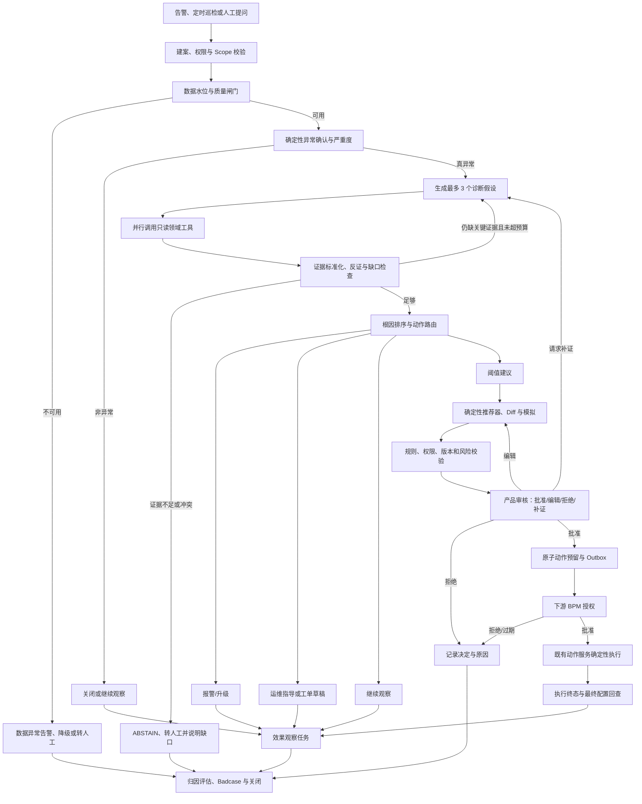

# 城市异动诊断 Agent：完整建设蓝图

> 文档基线：2026-09-04
>
> 当前性质：下一阶段产品与技术规划，不是已上线成果
>
> 总目标：把“发现城市异常后靠人反复查数、判断、沟通和改配置”升级为一套可追溯、可评测、有人审、可恢复的诊断与处置工作流。

## 先看结论

截至本文档基线，现有系统真正具备的是一条“外部系统给出结构化阈值建议 → 有限参数校验 → 独立审批 → 同意后异步尝试确定性执行 → 内部回查与日志审计”的动作底座；外部上游尚不能获得完整、持久化的数据库执行终态。它还不会主动发现城市异常，也不会读取经营数据、分析根因或回收调整效果。

下一步不应直接做一个可以任意调用工具的全自治大模型，而应建设：

> **确定性 Workflow 包住有限 Agent 决策，统计方法负责发现异常，领域工具负责取证，LLM 负责提出和验证有限假设，规则与优化器负责计算候选动作，产品审核与下游 BPM 共同控制生产写入，效果观察任务负责闭环。**

首版推荐使用 LangGraph `StateGraph` 作为编排器；现有 Java 阈值服务在抽取共享领域校验并补齐幂等、版本保护和终态回传后，继续作为唯一动作执行平面。每个异常建立一个可持久化、可暂停、可重放的 `diagnosis_case`，最后可能输出五类结果：

1. 不是真异常，关闭或继续观察；
2. 数据质量或上游系统异常，通知对应负责人；
3. 现场运维问题，给出带证据的排查与缓解 Runbook；
4. 需要人工进一步调查，整理已知事实并明确缺什么；
5. 阈值不匹配，生成受约束的调整建议、Diff、风险和观察/回滚条件；产品审核通过后可靠提交下游 BPM，只有下游授权与执行终态都可证明时才进入效果观察。

## 文档状态标签

本目录所有数字和能力必须使用以下标签，不允许混写：

| 标签 | 含义 | 当前如何使用 |
|---|---|---|
| 【已证实事实】 | 有代码、评测、日志或材料可以追溯 | 仅用于现有阈值执行底座 |
| 【待测基线】 | 必须先采集，但目前没有可靠数据 | 人工排查时长、告警噪声、诊断准确率、线上吞吐等 |
| 【规划门槛】 | 进入下一阶段前的 go/no-go 标准 | 例如危险动作数为 0、证据引用正确率达到门槛 |
| 【预期目标】 | 希望产生的改善，尚未通过实验验证 | 例如降低人工诊断时间；具体值只在评测文档维护 |
| 【实际结果】 | 上线或灰度后按既定口径测得的结果 | 当前城市诊断 Agent 全部为空 |

任何未来写入简历的城市 Agent 数字，都必须先从【规划门槛/预期目标】迁移为【实际结果】，并补齐样本、时间、对照、置信区间和适用边界。

## 当前起点与目标能力

| 能力平面 | 当前状态 | 下一步目标 |
|---|---|---|
| 观察 | 未建设城市指标接入、数据质量和告警治理 | 定时巡检、事件触发、异常检测、去重和严重度分级 |
| 诊断 | 未建设多步诊断 | 有界假设生成、并行取证、反证搜索、根因排序与拒答 |
| 决策 | 只有外部结构化建议接入 | 阈值建议、运维指导、升级/工单、继续观察等多动作路由 |
| 编排 | 没有生产级图状态机 | LangGraph checkpoint、interrupt、resume、预算和失败恢复 |
| 动作 | 部分已有：审批同意后异步执行、内部回查和审计 | 补共享领域校验、Dry Run、版本保护、持久化幂等、可靠恢复和外部终态回传 |
| 学习 | 未建设效果闭环 | T+30m/T+2h/T+24h 等观察、Badcase、评测集和策略迭代 |

详细事实边界见 [现状基线与建设边界](00-现状基线与建设边界.md)。

## 北极星与问题定义

北极星不是“Agent 调了多少次阈值”，而是：

> 在不增加危险生产动作的前提下，让真实城市异常更早被发现、更快形成可审阅的证据链和处置方案，并通过对照实验验证人工时间与异常持续时间确实下降。

建议把一条异常的主过程拆成：

```text
可检测 T_detectable
  → 建案/告警 T_alert
  → 人工接手 T_ack
  → 证据齐备 T_evidence_ready
  → 可审阅建议 T_recommendation
  → 产品审核 T_product_review
  → 下游审批 T_downstream_approval
  → 执行终态 T_execution_final
  → 指标恢复 T_recovery
  → 效果归因与案件关闭
```

统一使用 `MTTD = T_alert - T_detectable`、`MTTA = T_ack - T_alert`；时间点缺失时保留缺失原因，不用其他时间悄悄代替。完整口径见[评测、灰度、SLO 与量化目标](04-评测灰度SLO与量化目标.md)。

其中：

- 首期主要改善“发现到建议”的人效和质量；
- 阈值改动不是每个案件的必选终点；
- 业务结果必须通过随机/阶梯灰度或匹配对照评估，不能把自然回落写成 Agent 收益；
- QPS 是容量约束，不是低频高价值内部 Agent 的北极星。

## 推荐的完整工作流



完整节点、State 和边定义见 [LangGraph 架构与状态机](02-LangGraph架构与状态机.md)。

## 能力地图

### 1. 异常发现与报警治理

- 定时城市健康巡检、指标事件和人工提问三种触发方式；
- 支持城市、运营区、车型、时段和业务指标的多层 Scope；
- 规则、稳健统计、季节性基线和轻量模型组合检测；
- 数据延迟、分母异常、突变和缺失单独作为数据质量事件；
- 同城市、同根因、同时间窗口的告警聚合、去重、抑制和冷却；
- 按影响范围、强度、持续时间和数据可信度分级；
- 日报/周报展示趋势、重复问题、未关闭案件和潜在风险。

### 2. 诊断与证据

- 把业务问题转成最多 3 个可验证假设；
- 并行查询供需、车辆、电池/换电、履约、工单、配置、服务健康、天气活动和历史案件；
- 每个事实绑定 `evidence_id`、数据截止时间、查询条件、口径和工具版本；
- 同时记录支持证据和反证，禁止只找支持当前结论的数据；
- 证据不足、数据过期、结论冲突时正确拒答并转人工；
- 根因允许多标签和未知，不强制生成一个“看起来完整”的唯一答案。

### 3. 处置与运维指导

- 输出观察、升级、运维处置、工单草稿、阈值调整或回滚建议；
- 运维 Runbook 包含现象、范围、证据、验证步骤、临时缓解、负责人、禁止操作、恢复判据和回滚方法；
- 识别近期配置变更、发布、服务故障和数据延迟，避免错误归因给业务；
- 对正在发生的严重事件生成交接摘要，减少值班轮转的信息损失；
- 所有外部通知首期生成人工可审阅草稿，低风险动作经灰度证明后再评估自动化。

### 4. 阈值建议与受控执行

- LLM 解释“为什么可能需要调整”，但不自由拍数值；
- 规则或约束优化器依据当前值、允许范围、变化速率、冷却期和历史响应生成候选值；
- 执行前查询当前配置，生成完整 Diff 和影响范围；
- 用配置版本做 Compare-and-set，防止审批期间配置被其他人修改；
- 产品审核支持批准、编辑、拒绝和请求补证；编辑会生成新的不可变建议版本并重新校验；
- 产品审核通过后才由应用侧做动作预留和可靠投递，下游 BPM 授权与数据库执行终态分别建模，最终必须回查；
- 为每个动作设置观察窗口、Guardrail 和回滚建议。

### 5. 反馈学习

- 保存告警时点快照，避免用事后信息污染回放；
- 收集专家根因、证据、是否行动、允许动作区间和拒绝/修改原因；
- 跟踪执行前后指标、同时发生的人工操作和外部混杂因素；
- 每周把拒绝、编辑、回滚、严重漏报和随机阴性样本加入 Badcase；
- 先优化工具、口径、规则、上下文和 Prompt，只有稳定错误簇和足够数据才考虑微调。

## 推荐技术边界

| 模块 | 首版建议 | 为什么 |
|---|---|---|
| Workflow | Python + FastAPI + LangGraph `StateGraph` | 图结构清晰，适合持久化、分支、暂停和重放 |
| 状态与案件 | PostgreSQL + 生产级 Checkpointer | 任务、审批、执行和观察必须耐进程重启 |
| 缓存与限流 | Redis | 只做短期缓存、锁、去重与限流，不做唯一事实源 |
| 数据工具 | 受控领域 API/MCP | 模型只能调用参数化聚合工具，不能执行任意 SQL |
| 异常检测 | 规则 + 稳健统计 + 可选轻量 ML | 可解释、可回放，避免让 LLM 判断原始时序异常 |
| 诊断 | 大小模型路由的有限 Planner/Verifier | 只处理难规则化的假设、取证计划和解释 |
| 推荐 | 规则/约束优化器 | 数值、边界与冲突交给确定性程序 |
| 动作 | 加固后的既有 Java 阈值服务 | 抽取共享领域校验，并补版本、幂等和终态后复用审批与执行，不让模型直写 |
| 可观测 | OpenTelemetry + 指标/日志平台 | 把案件、模型、工具、审批、执行和效果串成一条 Trace |

框架和版本在真正实现前必须重新核对；本文引用的是截至 2026-09-04 的官方文档。

## 建设阶段与硬门槛

| 阶段 | 主要交付 | 写生产权限 | 进入下一阶段的核心条件 |
|---|---|---:|---|
| P0 Baseline | 人工流程基线、指标口径、Episode 与标签规范 | 无 | 时间和样本门槛同时满足，基线可冻结 |
| P1 数据与 Eval 地基 | Point-in-Time 数据、Gold/Safety 套件、最小共享校验/版本/幂等状态契约 | 无 | 数据可重放，安全契约可测试 |
| P2 Workflow 骨架 | LangGraph 状态机、Checkpoint、预算、Trace 与故障恢复 | 无 | 关键路径可重放、可暂停、可终止 |
| P3 Read-only MVP | 异常确认、并行取证、根因、运维报告和 ABSTAIN | 无 | 固定离线评测套件的质量与安全闸门通过 |
| P4 推荐与动作加固 | 约束推荐、Diff/Dry Run、完整 Action Adapter、终态和回滚 | 仅 Dry Run，不提交 | Canary 前动作面闭环可证 |
| P5 Replay / Shadow | 历史冻结回放与线上只读影子验证 | 无 | 质量、稳定性与严重样本门槛通过 |
| P6 Pilot | 面向运营展示诊断、Runbook 与 Dry Run | 无 | 人工辅助有效且错误预算未耗尽 |
| P7 Canary | 小范围提交低风险建议 | 必须人审 | 早期零事故闸门、终态和 Guardrail 通过 |
| P8 Scale | 扩 Scope、受控实验、效果回收与持续学习 | 高风险仍人审 | 有对照的质量、效率和业务价值成立 |

P0–P8 是建设阶段；Replay、Shadow、Pilot、Canary、Scale 是发布验证阶段。两者有对应关系但不能混为同一套编号。正式评测 KPI、样本门槛、SLO、发布 Go/No-Go 和样本不足规则的权威数值只在[评测、灰度、SLO 与量化目标](04-评测灰度SLO与量化目标.md)维护；其他文档可以保留工具预算示例和“危险动作必须为零”等安全不变量。

## 预期目标，不是当前成绩

当前只保留以下方向，不在总览重复具体数字：

- 【预期目标】更早发现严重异常，并分别降低 Episode 级告警噪声与通知级重复；
- 【预期目标】缩短人工接手、证据准备和可审阅建议形成时间，减少每个 Episode 的人工投入；
- 【规划门槛】关键结论可追溯，越权、重复、无审计和未知执行终态触发硬停止；
- 【预期目标】通过有同期控制的实验验证异常持续时间或异常面积改善，且业务 Guardrail 不劣化；
- 【规划门槛】容量同时验证入口接收、完成态吞吐、队列年龄和恢复，而不是只看启动 QPS。

所有正式质量/效果目标值、最小评测样本、置信区间、滚动错误预算和 `INSUFFICIENT_EVIDENCE` 规则以[评测、灰度、SLO 与量化目标](04-评测灰度SLO与量化目标.md)为唯一口径，均不得写成当前成绩。

## 文档导航

| 想解决的问题 | 阅读文档 |
|---|---|
| 现在到底有什么、缺什么、哪些话不能说 | [00-现状基线与建设边界](00-现状基线与建设边界.md) |
| 为什么做、给谁用、异常与动作有哪些、产品价值如何衡量 | [01-产品目标与业务能力](01-产品目标与业务能力.md) |
| LangGraph 怎么落、State/节点/边/审批/恢复怎么设计 | [02-LangGraph 架构与状态机](02-LangGraph架构与状态机.md) |
| 数据从哪来、工具怎么封、是否微调、训练集怎么建 | [03-数据工具与模型策略](03-数据工具与模型策略.md) |
| 怎么评测、Shadow/灰度怎么做、QPS/延迟/收益怎么证明 | [04-评测灰度SLO与量化目标](04-评测灰度SLO与量化目标.md) |
| 按周怎么实现、怎么值班、降级、回滚和复盘 | [05-实施路线图与运维手册](05-实施路线图与运维手册.md) |

## 对面试表达的约束

现在可以说：

> 我完成了城市异动诊断 Agent 面向生产约束的详细演进方案，并基于已有阈值审批与执行底座，拆出了观察、诊断、决策、动作和学习五个平面。方案计划采用持久化图式 Workflow，把 LLM 限制在假设与解释环节，数值建议走确定性推荐器和 Dry Run，并把产品审核、下游 BPM、真实执行与最终状态回查分开；同时设计了 Episode 数据、轨迹评测、Shadow/灰度和因果效果验证方案。上述诊断能力当前仍是设计，尚未实现。

现在不能说：

- 已上线完整城市异动诊断 Agent；
- 已使用 LangGraph/MCP 完成生产诊断；
- 已训练或微调诊断模型；
- 已达到本文任何规划中的准确率、延迟、QPS、采纳率或业务收益；
- 审批通过就代表配置修改成功；
- 阈值解析项目已有评测等同于城市诊断评测。

真正实施后，面试表述必须替换成“范围 + 个人职责 + 技术决策 + 评测设计 + 实际数字 + 失败边界”，不能只讲宏大架构。

## 维护规则

每次推进后按这个顺序更新：

1. 在 [城市 Agent 实施进度](../../tracking/04-城市Agent实施进度.md) 标记阶段、完成项、阻塞和实际指标；
2. 在 [现状基线](00-现状基线与建设边界.md) 把能力从“待建设”迁移到“已证实”，附证据位置；
3. 在 [评测文档](04-评测灰度SLO与量化目标.md) 填实际样本、Baseline、结果和置信区间；
4. 在 `docs/evidence/01-事实指标与待补证台账.md` 同步可对外使用的事实；
5. 只有当实际结果通过事实台账，才更新项目总结和简历候选素材；
6. 框架、模型、MCP 和安全规范有版本变化时，更新“检索日期”和迁移说明。

## 官方方法依据

- [LangGraph：Persistence](https://docs.langchain.com/oss/python/langgraph/persistence)：checkpoint、线程状态、故障恢复和跨线程 Store。
- [LangGraph：Interrupts](https://docs.langchain.com/oss/python/langgraph/interrupts)：人工暂停/恢复以及副作用幂等要求。
- [Anthropic：Building effective agents](https://www.anthropic.com/engineering/building-effective-agents)：优先从简单、可组合的 Workflow 开始，只在需要时增加自主性。
- [MCP 2026-07-28 specification](https://modelcontextprotocol.io/specification/2026-07-28)：工具协议、安全和最新规范入口。
- [OpenAI Agents SDK：Tracing](https://openai.github.io/openai-agents-python/tracing/)：Agent、工具、Guardrail 和 Handoff 的 Trace 设计参考。
- [OpenTelemetry GenAI semantic conventions](https://opentelemetry.io/docs/specs/semconv/registry/attributes/gen-ai/)：GenAI 观测字段参考；当前实现时应锁版本并保留内部稳定字段。
