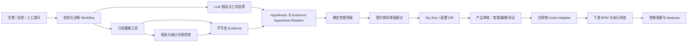

# 城市异动诊断 Agent

更新日期：2026-09-04

> 本文是用于项目复盘和面试叙述的精简版。下一阶段的产品范围、LangGraph 状态机、数据/MCP 工具、模型与微调策略、评测灰度、SLO、最早约 20 周且以阶段闸门为准的实施计划和运维 Runbook，统一维护在 [城市异动诊断 Agent 完整建设蓝图](../city-agent/README.md)。

## 1. 当前事实状态

> 现有材料能证明人工阈值链路已有查询、自然语言结构化、完整领域校验、预览、BPM、执行和审计；外部 Agent 直传链路能接收结构化建议、做有限字段校验并提交独立审批，但尚未自动串联完整实体校验、预查询、Diff 和执行终态回传。城市异常识别、Hive MCP、多步诊断 Workflow 和效果反馈也没有上线证据。

所以当前最准确的项目定位是：

> **基于既有阈值执行底座完成的城市异动诊断 Agent 演进设计。**

初版简历中的“核心功能已正式上线并持续迭代”需要额外代码、部署和效果材料支撑。在补证前不能使用。

## 2. 它解决什么问题

阈值平台解决“用户已经知道要改什么之后，怎样安全执行”；城市诊断 Agent 要把流程前移：

- 哪个城市、区域、车型和时段出现异常；
- 是需求、车辆供给、换电能力、天气还是活动导致；
- 当前阈值是否不合适；
- 是否应该调整、调整多少、风险是什么；
- 调整后是否有效，是否需要回滚。

```text
发现异常
→ 验证数据质量
→ 计算异常范围
→ 生成少量候选原因
→ 调工具补证据
→ 形成受规则约束的建议
→ Dry Run 与产品审核
→ 应用侧可靠提交下游 BPM
→ 复用现有执行服务并核对终态
→ 效果回看
```

## 3. 设计的核心原则

### 3.1 数值事实由程序产生

同比、环比、滚动基线、样本门槛和多指标一致性由 SQL/统计程序计算。LLM 负责组织假设、选择下一步证据和解释，不凭感觉生成异常数值。

### 3.2 结论必须绑定证据

每个事实和诊断保存来源、数据时间和 evidence_id；假设必须声明支持证据、反驳条件和拿不到证据时是否继续。证据不足时输出 LOW 或 ABSTAIN，而不是勉强给调整方案。

### 3.3 推荐值受规则约束

LLM 只提出可能的动作方向和理由；确定性推荐器根据当前配置、业务规则、变化速率和冷却期判断动作是否有资格，并计算最终方向、候选范围与数值。建议必须包含作用范围、原因、证据、预期影响、风险和回滚条件。

### 3.4 Agent 不直接写生产

执行前必须查询当前配置、生成 Diff、检查在途审批和冷却期，再由人工确认后进入独立 BPM。最终写入继续复用已有确定性执行和审计链路。

### 3.5 Workflow 必须可暂停和恢复

状态需要保存 scope、数据质量、`evidence_refs`、可回指证据的事实摘要、hypotheses、tool trace、不可变 recommendation 版本、产品审核、下游审批、执行和观察状态。Graph State 不是事实源；可信事件进入 Inbox 后按案件、等待槽和版本恢复，重试不能重复提交或重复写入，审批通过也不能直接当成配置已生效。

## 4. 目标架构



MCP、Function Calling、Workflow 和规则的基础分工见 [城市诊断 Agent 系统设计](../knowledge/01-城市诊断Agent系统设计.md)；可直接执行的完整方案见 [城市异动诊断 Agent 完整建设蓝图](../city-agent/README.md)，不在个人项目正文重复展开。

## 5. 已有底座与待建设能力

### 阈值平台可复用、但尚未全部接入 Agent 的资产

| 可复用资产 | 接入前仍要补什么 |
|---|---|
| 城市/区域/车型知识和归属校验 | 抽成 Agent 与人工入口共用的权威 Scope 服务 |
| 自然语言阈值命令解析与完整性校验 | 诊断 Agent 接收结构化结论时不重复调用 LLM，但仍复用业务校验 |
| 当前配置查询和人工预览 | BPM 前自动生成带版本的查询、Diff 与 Dry Run |
| 确定性读改写和执行后回查 | 增加配置版本保护、持久化幂等和外部可查的执行终态 |
| BPM、分阶段回调和审计 | 区分审批终态与执行终态，并支持重启恢复和可靠通知 |

### 外部 Agent 直传当前实际串联

```text
已生成的结构化建议
→ 有限字段格式校验
→ 独立人工审批
→ 同意后异步尝试确定性执行
→ 内部回查与日志审计
```

这条直传链路尚不能证明完整实体归属校验、阈值业务上下限、提交前自动预览或外部执行终态已经闭环。受控经营数据工具、确定性异常检测、多步诊断、证据评分、推荐器和效果回看均待建设。

## 6. 面试怎样讲

### 当前可以说

> 我完成了阈值智能调整的解析、规则、预览、BPM、执行和审计底座，并为外部 Agent 建设了接收结构化建议的独立审批入口。在此基础上，我设计了下一阶段城市异动诊断 Agent：计划用只读数据工具和状态化 Workflow 编排数据质量、异常检测、假设下钻、证据评分、阈值建议、Dry Run、产品审核、下游 BPM、执行终态和效果回看。方案重点设计了 LLM 与确定性规则的边界、工具权限、ABSTAIN、幂等和降级，这些诊断能力仍待实现与评测。

### 当前不能说

- 已全量上线并自动调整大量城市；
- 已有诊断准确率、建议采纳率或业务提升；
- 天气、活动、人员等数据已经稳定接入；
- 已实现完整自主工具循环或 Multi-Agent；
- Agent 无需人审即可写生产。

## 7. 是否应该单独写进简历

当前建议：

- 面试中可作为系统设计和演进思考讲；
- 简历篇幅紧张时，并入阈值系统的一条“下一阶段架构设计”；
- 只有补齐代码、部署、工具轨迹和效果数据后，再作为第三个正式上线项目单列。

候选 Bullet：

> 基于现有阈值安全执行底座，设计城市异动诊断 Agent 演进方案：以受控只读工具获取经营指标，用状态化 Workflow 编排数据质量、异常检测、证据下钻、确定性建议、Dry Run、产品审核、下游 BPM、执行终态和效果回看，并设计 ABSTAIN、幂等和人审边界。

## 8. 待本人补证

1. 是否存在另一个城市诊断代码仓或服务；
2. 已实现的工具、数据源和 Workflow 节点；
3. 部署时间、覆盖范围、调用量和真实用户；
4. 天气、活动、人员规模等是否真实接入；
5. 历史诊断集、专家金标、工具轨迹和 Badcase；
6. 诊断命中率、排查耗时、采纳率和业务效果；
7. 本人在产品、数据、Agent 编排、后端和发布中的职责；
8. 如果没有额外证据，是否确认从正式简历中撤掉“已上线”表述。
