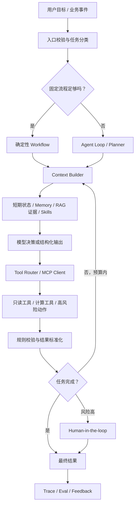

# Agent、RAG 与 Eval 知识地图

这不是框架 API 笔记，而是面试时用来设计和解释生产系统的骨架。

## 1. 一张总图



任何 Agent 面试题都可以落回六个问题：

1. 状态是什么；
2. 模型决定什么；
3. 工具提供什么事实或动作；
4. 程序约束什么；
5. 人在哪些风险点授权；
6. 怎样证明结果正确并定位失败。

## 2. 什么时候用什么

| 手段 | 解决的问题 | 不适合替代什么 |
|---|---|---|
| Prompt / Structured Output | 稳定任务说明与输出结构 | 最新事实、严格权限、复杂业务计算 |
| RAG | 按请求获取外部知识并提供证据 | 实时事务状态、需要执行的动作 |
| Tool Calling | 读实时事实或执行明确能力 | 决定复杂业务政策 |
| MCP | 标准化工具发现、调用和资源接入 | 业务编排与安全策略本身 |
| Skill | 固化可复用的任务方法、脚本和验收 | 通用知识检索 |
| Workflow | 路径已知、风险高、要求可审计的流程 | 高不确定探索中的全部决策 |
| Agent Loop | 路径无法预先穷举、需根据观察决定下一步 | 简单固定流程 |
| Fine-tuning | 稳定改变模型行为、风格或领域能力 | 频繁更新知识、权限和确定性规则 |
| 规则引擎 | 硬约束、范围、权限和可解释决策 | 模糊自然语言理解 |

最常见的正确架构不是“全 Agent”，而是确定性 Workflow 包住局部 Agent 决策。

## 3. Agent Loop

最小循环：

```text
读取目标与状态
→ 装配当前必要上下文
→ 模型选择下一步或输出结果
→ 校验 Tool Call
→ 执行工具并标准化 Observation
→ 更新显式状态
→ 判断成功、失败、人工升级或继续
```

必须有的边界：

- 最大步数、最大工具数、总时限和 Token/费用预算；
- 每次状态变化持久化或可重建；
- 失败分类，而不是所有错误都重试；
- 重复动作有幂等键；
- 高风险工具默认不可用或需要人工确认；
- 最终答案与证据/工具结果绑定；
- 循环震荡、重复查询和无进展可以被检测。

## 4. Context Engineering

Prompt 是一段指令；Context 是本次模型调用真正看到的全部信息；Harness 负责持续选择、组织和更新这些信息。

推荐装配顺序：

1. 不可变系统约束与权限；
2. 当前目标、成功标准和剩余预算；
3. 显式 Workflow 状态；
4. 与当前步骤相关的 Skill；
5. 经权限和时效校验的 Memory；
6. RAG/工具证据；
7. 必要的最近交互；
8. 当前待决问题与输出 Schema。

常见问题：

- 上下文过长导致注意力竞争，而不只是超 Token；
- 旧摘要覆盖用户的新指令；
- 把模型推断写成长期事实；
- 工具返回整份文档，挤掉关键约束；
- RAG 证据与 Memory 来源没有标签；
- 压缩后丢失未完成任务或风险边界。

## 5. Memory

| 类型 | 内容 | 生命周期 | 风险 |
|---|---|---|---|
| Working | 当前目标、步骤、中间结果 | 单任务 | 窗口溢出、状态丢失 |
| Episodic | 某次任务的轨迹和结果 | 跨任务、可过期 | 失败经验被错误泛化 |
| Semantic | 稳定事实和偏好 | 长期、带来源 | 过期或冲突 |
| Procedural | 怎样做一类任务 | 版本化 | 流程僵化、权限升级 |

写入门控至少检查：是否值得复用、来源是否可靠、用户是否授权、是否含敏感信息、多久过期、与已有事实是否冲突。当前明确指令和权威实时工具通常优先于旧 Memory。

## 6. Tool、MCP 与 Skill

### 好 Tool 的特征

- 名称描述业务动作，不是模糊的 `do_task`；
- 输入字段有类型、枚举、必填、单位和示例；
- 输出是结构化事实，包含时间、来源和状态；
- 错误可分类：非法参数、无权限、超时、暂时失败、业务冲突；
- 支持超时、取消、分页/字段选择和幂等；
- 高风险动作与只读查询分开；
- Trace 能看到选择理由、参数摘要、耗时和结果。

### 三者边界

- Function Calling：模型产生结构化调用意图的能力；
- MCP：Client 与外部工具/资源交互的一套标准协议；
- Skill：把任务说明、工具组合、脚本、规则和验收固化为可复用能力。

MCP 不会自动解决工具选择、安全、编排和业务正确性；这些属于 Harness、Workflow 和领域程序。

## 7. RAG 全链路

```text
数据源
→ 解析与清洗
→ 结构化/语义切片
→ Embedding 与稀疏索引
→ Query 理解/改写/过滤
→ 混合召回
→ Rerank
→ 去重和 Context Packing
→ 带引用生成
→ 检索评测 + 答案评测
```

### 关键取舍

- 小 Chunk 易精确召回但上下文不完整；可用 parent-child 检索小块、返回父块；
- Dense 擅长语义，BM25 擅长专有名词和精确字符串，企业知识常用混合召回；
- Metadata Filter 应在检索阶段落实权限，不在生成后再删；
- Rerank 提高 Top-K 质量但增加延迟和成本；
- Query Rewrite 对歧义和多轮有帮助，但可能改变用户意图，必须保留原查询；
- 数据删除和权限撤销要能及时从索引生效。

### 分阶段指标

| 阶段 | 典型指标 |
|---|---|
| 数据接入 | 解析成功率、字段覆盖、索引新鲜度 |
| 召回 | Recall@K、Hit@K |
| 排序 | MRR、NDCG@K |
| 上下文 | 证据覆盖、冗余率、Token 使用 |
| 生成 | Correctness、Faithfulness、引用准确率 |
| 端到端 | 任务成功率、人工采纳、延迟、成本 |

阈值项目当前的城市/运营区知识更接近“权威实体知识增强”。没有完整文档切片、向量召回、Rerank 和检索评测证据时，不应包装成成熟通用 RAG 平台。

## 8. Agent Eval

### 四层指标

1. 最终结果：任务是否完成、答案或动作是否正确；
2. 轨迹：步骤是否必要、顺序是否合理、是否重复/震荡；
3. 工具：选择、参数、调用成功、返回使用是否正确；
4. 系统：延迟、成本、稳定性、安全和人工介入。

### 评分方法

- 确定性规则：Schema、精确字段、数值、集合完整性；
- 程序执行：在沙箱或测试环境验证最终状态；
- 人评：复杂业务判断和解释质量；
- LLM-as-Judge：扩展开放题评测，但需用人评样本校准偏差；
- Pairwise：比较版本时通常比绝对打分更稳定；
- 多次采样：估计非确定性和长尾失败。

### 数据集结构

- 高频正常任务；
- 长尾复杂任务；
- 缺信息与应拒答任务；
- 工具失败与数据过期；
- 对抗/越权/Prompt Injection；
- 历史线上 Badcase；
- 每次修复都加入回归集。

## 9. 可观测性

一次任务至少能通过 request/trace id 串起：

- 用户目标与输入摘要；
- 模型、Prompt、参数和 Context 版本；
- RAG 索引版本与证据 ID；
- 每次 Tool Call、耗时、重试和错误；
- 状态变化、人工确认和最终输出；
- Token、费用、端到端延迟；
- 评测结果和错误 taxonomy。

不要默认记录完整敏感 Prompt、工具响应或 Chain-of-Thought。可观测性需要数据最小化和访问控制。

## 10. 安全与可靠性

- 最小权限：只读工具与写工具分离；
- 参数校验：实体、范围、单位和业务约束由程序检查；
- Prompt Injection：外部文档视为不可信数据，不能升级为系统指令；
- 人工确认：不可逆、批量、高价值或证据不足的动作；
- 幂等：同一任务重放不会重复产生副作用；
- 重试：仅对暂时性错误，指数退避并设上限；
- 降级：固定 Workflow、只读答案、人工转交或 ABSTAIN；
- 回滚：保存变更前状态、版本和触发条件；
- 隐私：Context、Memory、Trace 和 Eval 数据均需权限与删除策略。

## 11. 与个人项目的映射

| 知识点 | 当前最强项目证据 | 边界 |
|---|---|---|
| Structured Output | 阈值自然语言解析 | 不等于模型直接执行 |
| 领域知识增强 | 城市/运营区权威实体查询 | 不宣称完整向量 RAG |
| 确定性校验 | 阈值 Java 规则 | 需补长期错误漏斗 |
| Human-in-the-loop | 预览 + BPM | 幂等与异步可靠性仍可改进 |
| Eval | 42 条金标、239 次调用 | 样本小、离线为主 |
| Badcase | 批量静默漏项 | 已识别，不等于完全消除 |
| 有状态 Agent | 城市诊断设计 | 当前缺上线实现证据 |
| ML Eval | 时效 OOT/同工单/分桶 | 业务因果收益待补 |

## 12. 面试回答模板

面对一个新 Agent 场景，按顺序回答：

1. 业务目标与错误成本；
2. 为什么需要/不需要 Agent；
3. 固定 Workflow 和模型决策的边界；
4. 状态、Context、知识和工具；
5. 正常链路与三类失败链路；
6. 权限、人审、幂等和降级；
7. 离线数据集与分层指标；
8. shadow/灰度/上线观测；
9. 当前方案的限制和下一步。
